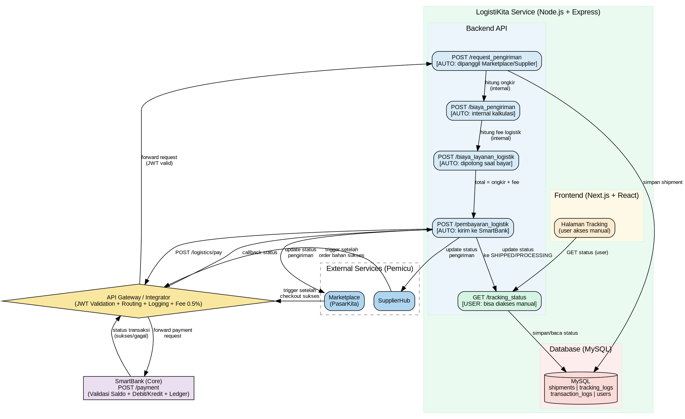

# LogistiKita — README & Spesifikasi Sistem

> **Konteks:** LogistiKita adalah satu dari tujuh aplikasi dalam ekosistem simulasi ekonomi UMKM pada Tugas Besar Mata Kuliah RPL 2.
> Dosen: M. Yusril Helmi Setyawan, S.Kom., M.Kom.
> Arsitektur: **Microservices** | Stack: **Next.js + React.js** (frontend), **Node.js + Express** (backend), **MySQL** (database)

---

## Daftar Isi

1. [Deskripsi Aplikasi](#1-deskripsi-aplikasi)
2. [Peran dalam Ekosistem](#2-peran-dalam-ekosistem)
3. [Fitur Utama & Klasifikasi Trigger](#3-fitur-utama--klasifikasi-trigger)
4. [Diagram Arsitektur (Graphviz)](#4-diagram-arsitektur-graphviz)
5. [Flow Proses (IPO) Tiap Fitur](#5-flow-proses-ipo-tiap-fitur)
6. [API Endpoint Contract](#6-api-endpoint-contract)
7. [Integrasi dengan SmartBank](#7-integrasi-dengan-smartbank)
8. [Desain Database](#8-desain-database)
9. [Mekanisme Transaksi & Fee — Penjelasan Lengkap](#9-mekanisme-transaksi--fee--penjelasan-lengkap)
10. [Aturan Keuangan yang Berlaku](#10-aturan-keuangan-yang-berlaku)
11. [Aturan Pengerjaan](#11-aturan-pengerjaan)
12. [Panduan Stack & Struktur Proyek](#12-panduan-stack--struktur-proyek)

---

## 1. Deskripsi Aplikasi

**LogistiKita** adalah aplikasi manajemen pengiriman barang yang berfungsi sebagai **cost driver** dalam ekosistem ekonomi UMKM. Aplikasi ini **tidak memproses pembayaran secara langsung** — semua pembayaran ongkos kirim didelegasikan sepenuhnya kepada **SmartBank** melalui API Gateway.

### Ringkasan Teknis

| Atribut | Nilai |
|---|---|
| Nama Aplikasi | LogistiKita |
| Kelompok Ekosistem | Aplikasi No. 5 |
| Peran Utama | Cost driver; memastikan distribusi barang |
| Pemicu (Trigger) | Dipicu oleh Marketplace (PasarKita) atau SupplierHub setelah transaksi berhasil |
| Input Utama | `order_id`, `alamat_pengiriman`, `jarak` (km) |
| Output Utama | `ongkir` (biaya pengiriman), `status_pengiriman` |
| Batasan Scope | Tidak mengelola pembayaran langsung; tidak menyimpan saldo; hanya request ke SmartBank |
| Endpoint Pembayaran | `POST /logistics/pay` → diteruskan ke SmartBank via API Gateway |

---

## 2. Peran dalam Ekosistem

LogistiKita berada di **sisi hilir** dari alur transaksi ekosistem. Alur keterlibatannya adalah sebagai berikut:

```
Marketplace / SupplierHub
        │
        │ (setelah pembayaran produk sukses di SmartBank)
        ▼
   LogistiKita
        │ 1. Terima order_id + alamat + jarak
        │ 2. Hitung ongkir
        │ 3. POST /logistics/pay → API Gateway → SmartBank
        │ 4. Terima status pembayaran dari SmartBank
        │ 5. Update status pengiriman
        ▼
  Aplikasi Asal (Marketplace/SupplierHub)
        │ menerima update status pengiriman
```

LogistiKita **tidak pernah** langsung berkomunikasi dengan user untuk memulai transaksi keuangan. Semua inisiasi pengiriman datang dari aplikasi lain, dan semua pembayaran diteruskan ke SmartBank.

---

## 3. Fitur Utama & Klasifikasi Trigger

Terdapat **5 fitur utama** LogistiKita. Berikut klasifikasi lengkapnya:

### Tabel Fitur

| No | Nama Fitur | Deskripsi | Endpoint | Jenis Trigger | Wujud / Interaksi |
|---|---|---|---|---|---|
| 1 | **Request Pengiriman** | Menerima permintaan pengiriman dari Marketplace atau SupplierHub | `POST /logistikita/request_pengiriman` | **Otomatis** — dipicu sistem eksternal (Marketplace/SupplierHub), bukan oleh user secara langsung | Tidak ada tombol user; ini adalah API endpoint yang dipanggil oleh service lain |
| 2 | **Biaya Pengiriman** | Menghitung ongkos kirim berdasarkan jarak | `POST /logistikita/biaya_pengiriman` | **Otomatis** — dieksekusi internal sebagai bagian dari alur Request Pengiriman, sebelum pembayaran | Tidak tampil sebagai aksi user; hasilnya ditampilkan di UI sebagai informasi kalkulasi |
| 3 | **Pembayaran Logistik** | Mengirim payment request ke SmartBank untuk membayar ongkir | `POST /logistikita/pembayaran_logistik` | **Otomatis** — dieksekusi setelah kalkulasi ongkir selesai, sebagai bagian satu alur dengan Request Pengiriman | Tidak ada aksi user; terjadi di balik layar setelah order diterima |
| 4 | **Tracking Status** | Memperbarui dan menampilkan status pengiriman (misal: PENDING → PROCESSING → SHIPPED → DELIVERED) | `GET /logistikita/tracking_status` | **User dapat memicu (pull)** — user membuka halaman tracking dan melihat status terkini | Ada UI-nya: halaman tracking pengiriman dengan nomor order |
| 5 | **Biaya Layanan Logistik** | Potongan fee layanan LogistiKita dari setiap transaksi pengiriman | `POST /logistikita/biaya_layanan_logistik` | **Otomatis** — dihitung dan dipotong bersamaan dengan proses pembayaran logistik, tidak bisa diopt-out | Tidak ada wujud aksi user; ditampilkan sebagai baris fee di ringkasan transaksi |

### Penjelasan Penting: Mana yang "Bisa User Pencet"?

- **Tracking Status** adalah satu-satunya fitur yang secara aktif diakses oleh user melalui antarmuka. User membuka halaman tracking, memasukkan atau melihat `order_id`, dan mendapatkan status terkini.
- **Request Pengiriman, Biaya Pengiriman, Pembayaran Logistik, dan Biaya Layanan Logistik** seluruhnya adalah proses backend yang berjalan **otomatis** sebagai satu rangkaian alur setelah Marketplace/SupplierHub menyelesaikan transaksi produk. User tidak menekan tombol apapun untuk memicu keempat fitur ini — mereka terjadi secara programatik.

---

## 4. Diagram Arsitektur (Graphviz)

Simpan kode berikut sebagai `architecture.dot` lalu render dengan `dot -Tpng architecture.dot -o architecture.png`.



---

## 5. Flow Proses (IPO) Tiap Fitur

### 5.1 — Request Pengiriman

```
INPUT:
  - order_id         (string, dari Marketplace/SupplierHub)
  - user_id          (string, pembeli / pemilik order)
  - alamat_tujuan    (string)
  - jarak            (float, dalam km — dikirim oleh aplikasi pemicu)
  - source_app       (enum: "marketplace" | "supplierhub")

PROSES:
  1. Validasi token JWT via API Gateway
  2. Validasi input: order_id tidak duplikat, jarak > 0, alamat tidak kosong
  3. Cek apakah order_id sudah terdaftar di tabel shipments → tolak jika sudah ada
  4. Simpan record baru ke tabel shipments dengan status = PENDING
  5. Panggil kalkulasi biaya pengiriman (trigger fitur 5.2)
  6. Panggil kalkulasi fee layanan (trigger fitur 5.5)
  7. Kirim payment request ke SmartBank (trigger fitur 5.3)
  8. Terima response dari SmartBank
  9. Update status shipment sesuai hasil pembayaran

OUTPUT:
  - shipment_id      (string, UUID baru)
  - status           (enum: PENDING | PROCESSING | FAILED)
  - ongkir           (integer, dalam Rupiah)
  - fee_layanan      (integer, dalam Rupiah)
  - total_biaya      (integer = ongkir + fee_layanan)
  - message          (string)
```

---

### 5.2 — Biaya Pengiriman (Kalkulasi Ongkir)

```
INPUT:
  - jarak            (float, km — berasal dari record shipment yang sudah dibuat)
  - order_id         (referensi internal)

PROSES:
  1. Ambil nilai jarak dari record shipment
  2. Hitung ongkir_raw = 5% dari nilai transaksi produk asli
  3. Terapkan aturan minimum: ongkir = MAX(ongkir_raw, 5000)
     → Lihat penjelasan lengkap di Bagian 9.1
  4. Simpan hasil kalkulasi ke record shipment

OUTPUT:
  - ongkir           (integer, dalam Rupiah)
  - jarak_km         (float)
  - catatan_kalkulasi (string, misal: "5% dari transaksi, minimum Rp5.000")
```

> **Catatan Penting:** Fitur ini adalah fungsi internal yang dipanggil secara otomatis oleh fitur Request Pengiriman. Tidak ada endpoint publik tersendiri yang dapat dipanggil langsung oleh user. Endpoint `/logistikita/biaya_pengiriman` digunakan untuk keperluan simulasi/mock saja.

---

### 5.3 — Pembayaran Logistik

```
INPUT:
  - shipment_id      (string)
  - order_id         (string)
  - user_id          (payer — pembeli)
  - total_biaya      (integer = ongkir + fee_layanan)
  - source_app       (string)

PROSES:
  1. Validasi total_biaya > 0
  2. Bangun payload payment request untuk SmartBank:
       {
         from_user: user_id,
         to_service: "logistikita",
         amount: total_biaya,
         metadata: { order_id, shipment_id, type: "ongkir" }
       }
  3. POST ke SmartBank via API Gateway: POST /logistics/pay
  4. Tunggu response SmartBank (sync)
  5. Jika SmartBank response SUCCESS:
       - Update status shipment → PROCESSING
       - Catat ke tabel transaction_logs
  6. Jika SmartBank response FAILED:
       - Update status shipment → FAILED
       - Catat alasan gagal ke transaction_logs

OUTPUT:
  - payment_status   (enum: SUCCESS | FAILED)
  - transaction_id   (string, dari SmartBank)
  - shipment_status  (enum: PROCESSING | FAILED)
  - message          (string)
```

---

### 5.4 — Tracking Status

```
INPUT:
  - order_id         (string, dari query param atau path param)
  - user_id          (dari JWT token — untuk validasi kepemilikan order)

PROSES:
  1. Validasi JWT token
  2. Query tabel shipments berdasarkan order_id
  3. Validasi bahwa user_id yang request = user_id pemilik shipment
  4. Query tabel tracking_logs untuk riwayat perubahan status
  5. Susun response dengan status terkini dan riwayat

OUTPUT:
  - shipment_id      (string)
  - order_id         (string)
  - status_terkini   (enum: PENDING | PROCESSING | SHIPPED | DELIVERED | FAILED)
  - riwayat_status   (array of { status, timestamp, keterangan })
  - alamat_tujuan    (string)
  - estimasi_tiba    (string, opsional)
```

> **Catatan:** Ini adalah satu-satunya fitur yang **dapat diakses secara aktif oleh user** melalui UI. User membuka halaman tracking dan sistem mengambil data secara on-demand (tidak realtime push, tapi pull saat halaman dibuka atau user klik refresh).

---

### 5.5 — Biaya Layanan Logistik

```
INPUT:
  - order_id         (string)
  - ongkir           (integer, hasil kalkulasi dari fitur 5.2)

PROSES:
  1. Ambil nilai ongkir dari record shipment
  2. Hitung fee = 5% dari ongkir
     (fee ini adalah biaya layanan LogistiKita, terpisah dari ongkir itu sendiri)
  3. Simpan nilai fee ke record shipment
  4. Fee ini dimasukkan ke dalam total_biaya yang dikirim ke SmartBank

OUTPUT:
  - fee_layanan      (integer, dalam Rupiah)
  - basis_kalkulasi  (integer, nilai ongkir yang dipakai sebagai basis)
```

> **Catatan:** Fitur ini adalah proses internal yang dieksekusi otomatis setelah kalkulasi ongkir. Tidak ada interaksi user.

---

## 6. API Endpoint Contract

Semua request harus menyertakan header:
```
Authorization: Bearer <JWT_TOKEN>
Content-Type: application/json
```

---

### 6.1 `POST /logistikita/request_pengiriman`

**Deskripsi:** Menerima permintaan pengiriman dari Marketplace atau SupplierHub. Endpoint ini dipanggil secara otomatis oleh service eksternal, bukan oleh user langsung.

**Request Body:**
```json
{
  "order_id": "ORD-20240601-0001",
  "user_id": "USR-001",
  "alamat_tujuan": "Jl. Merdeka No. 10, Bandung, Jawa Barat",
  "jarak": 12.5,
  "nilai_transaksi": 150000,
  "source_app": "marketplace"
}
```

| Field | Tipe | Wajib | Keterangan |
|---|---|---|---|
| `order_id` | string | Ya | ID order dari aplikasi pemicu |
| `user_id` | string | Ya | ID pembeli / pemilik order |
| `alamat_tujuan` | string | Ya | Alamat tujuan pengiriman |
| `jarak` | float | Ya | Jarak dalam km (dihitung oleh aplikasi pemicu) |
| `nilai_transaksi` | integer | Ya | Nilai transaksi produk (basis kalkulasi ongkir) |
| `source_app` | string | Ya | `"marketplace"` atau `"supplierhub"` |

**Response Sukses (201 Created):**
```json
{
  "success": true,
  "data": {
    "shipment_id": "SHIP-20240601-0001",
    "order_id": "ORD-20240601-0001",
    "status": "PROCESSING",
    "ongkir": 7500,
    "fee_layanan": 375,
    "total_biaya": 7875,
    "transaction_id": "TRX-SBANK-9981",
    "message": "Pengiriman berhasil diproses dan pembayaran telah dilakukan."
  }
}
```

**Response Gagal (400 Bad Request):**
```json
{
  "success": false,
  "error": {
    "code": "DUPLICATE_ORDER",
    "message": "order_id ORD-20240601-0001 sudah terdaftar."
  }
}
```

**Response Gagal Pembayaran (402 Payment Required):**
```json
{
  "success": false,
  "error": {
    "code": "PAYMENT_FAILED",
    "message": "Pembayaran ongkir gagal. Saldo user tidak mencukupi.",
    "smartbank_response": "INSUFFICIENT_BALANCE"
  }
}
```

---

### 6.2 `POST /logistikita/biaya_pengiriman`

**Deskripsi:** Menghitung estimasi biaya pengiriman. Endpoint ini digunakan secara internal oleh alur request_pengiriman. Dapat juga digunakan oleh frontend untuk menampilkan estimasi biaya sebelum checkout di aplikasi pemicu (bersifat informational, tidak langsung memproses pembayaran).

**Request Body:**
```json
{
  "nilai_transaksi": 150000,
  "jarak": 12.5
}
```

**Response Sukses (200 OK):**
```json
{
  "success": true,
  "data": {
    "nilai_transaksi": 150000,
    "jarak_km": 12.5,
    "ongkir_raw": 7500,
    "ongkir_final": 7500,
    "catatan": "5% dari nilai transaksi (Rp150.000 × 5% = Rp7.500). Melebihi minimum Rp5.000, maka digunakan nilai 5%."
  }
}
```

---

### 6.3 `POST /logistikita/pembayaran_logistik`

**Deskripsi:** Mengirimkan payment request ke SmartBank untuk membayar ongkir. Dipanggil secara otomatis setelah kalkulasi biaya selesai dalam alur `request_pengiriman`.

**Request Body (internal call):**
```json
{
  "shipment_id": "SHIP-20240601-0001",
  "order_id": "ORD-20240601-0001",
  "user_id": "USR-001",
  "ongkir": 7500,
  "fee_layanan": 375,
  "total_biaya": 7875
}
```

**Response Sukses (200 OK):**
```json
{
  "success": true,
  "data": {
    "payment_status": "SUCCESS",
    "transaction_id": "TRX-SBANK-9981",
    "shipment_status": "PROCESSING",
    "message": "Pembayaran ongkir berhasil diproses oleh SmartBank."
  }
}
```

---

### 6.4 `GET /logistikita/tracking_status`

**Deskripsi:** Mengambil status terkini dan riwayat status pengiriman berdasarkan `order_id`. Endpoint ini dapat diakses secara aktif oleh user melalui halaman tracking di frontend.

**Query Parameters:**
```
GET /logistikita/tracking_status?order_id=ORD-20240601-0001
```

| Parameter | Tipe | Wajib | Keterangan |
|---|---|---|---|
| `order_id` | string | Ya | ID order yang ingin dicek |

**Response Sukses (200 OK):**
```json
{
  "success": true,
  "data": {
    "shipment_id": "SHIP-20240601-0001",
    "order_id": "ORD-20240601-0001",
    "status_terkini": "SHIPPED",
    "alamat_tujuan": "Jl. Merdeka No. 10, Bandung, Jawa Barat",
    "riwayat_status": [
      {
        "status": "PENDING",
        "timestamp": "2024-06-01T09:00:00Z",
        "keterangan": "Permintaan pengiriman diterima"
      },
      {
        "status": "PROCESSING",
        "timestamp": "2024-06-01T09:01:05Z",
        "keterangan": "Pembayaran ongkir berhasil, menunggu kurir"
      },
      {
        "status": "SHIPPED",
        "timestamp": "2024-06-01T11:30:00Z",
        "keterangan": "Barang telah diambil kurir"
      }
    ]
  }
}
```

**Response Gagal (404 Not Found):**
```json
{
  "success": false,
  "error": {
    "code": "SHIPMENT_NOT_FOUND",
    "message": "Tidak ditemukan pengiriman untuk order_id ORD-20240601-0001."
  }
}
```

---

### 6.5 `POST /logistikita/biaya_layanan_logistik`

**Deskripsi:** Menghitung fee layanan LogistiKita dari nilai ongkir. Dipanggil secara otomatis sebagai bagian dari alur `request_pengiriman`.

**Request Body (internal call):**
```json
{
  "order_id": "ORD-20240601-0001",
  "ongkir": 7500
}
```

**Response Sukses (200 OK):**
```json
{
  "success": true,
  "data": {
    "fee_layanan": 375,
    "basis_ongkir": 7500,
    "persentase": "5%",
    "catatan": "Fee layanan LogistiKita sebesar 5% dari ongkir"
  }
}
```

---

### 6.6 Status Code Referensi

| HTTP Code | Makna |
|---|---|
| `200 OK` | Request berhasil (GET) |
| `201 Created` | Resource berhasil dibuat (POST shipment baru) |
| `400 Bad Request` | Input tidak valid atau duplikat |
| `401 Unauthorized` | Token JWT tidak ada atau tidak valid |
| `402 Payment Required` | Saldo tidak cukup atau SmartBank menolak |
| `403 Forbidden` | User tidak berhak mengakses resource ini |
| `404 Not Found` | Data tidak ditemukan |
| `429 Too Many Requests` | Melebihi batas transaksi harian (10/hari) atau cooldown |
| `500 Internal Server Error` | Error server |

---

## 7. Integrasi dengan SmartBank

### 7.1 Prinsip Dasar

LogistiKita **wajib** melalui API Gateway setiap kali berkomunikasi dengan SmartBank. Tidak ada koneksi langsung dari LogistiKita ke SmartBank tanpa melewati Gateway.

```
LogistiKita Backend
       │
       │ POST /logistics/pay
       ▼
  API Gateway
  ├── Validasi JWT
  ├── Logging request
  ├── Potong Fee Gateway (0.5% dari total_biaya)
       │
       │ Forward ke SmartBank
       ▼
  SmartBank
  ├── Validasi saldo user (cek >= total_biaya)
  ├── Debit saldo user sebesar total_biaya
  ├── Kredit ke akun LogistiKita sejumlah ongkir
  ├── Potong Fee Bank (1% dari total_biaya → ke reserve SmartBank)
  ├── Potong Pajak Sistem (2% dari total_biaya → money sink)
  └── Catat di Ledger
       │
       ▼
  SmartBank response → API Gateway → LogistiKita
```

### 7.2 Payload yang Dikirim LogistiKita ke SmartBank

```json
POST /payment  (SmartBank endpoint, via Gateway)
{
  "from_app": "logistikita",
  "from_user": "USR-001",
  "to_service": "logistikita",
  "amount": 7875,
  "metadata": {
    "order_id": "ORD-20240601-0001",
    "shipment_id": "SHIP-20240601-0001",
    "type": "ongkir",
    "breakdown": {
      "ongkir": 7500,
      "fee_layanan_logistik": 375
    }
  }
}
```

### 7.3 Response dari SmartBank

```json
{
  "status": "SUCCESS",
  "transaction_id": "TRX-SBANK-9981",
  "timestamp": "2024-06-01T09:01:05Z",
  "deducted_amounts": {
    "pokok": 7875,
    "fee_bank": 78,
    "pajak_sistem": 157,
    "fee_gateway": 39,
    "total_debit": 8149
  },
  "new_balance": 41851
}
```

### 7.4 Penanganan Error SmartBank

| Error Code | Kondisi | Tindakan LogistiKita |
|---|---|---|
| `INSUFFICIENT_BALANCE` | Saldo user kurang | Update shipment status → FAILED, kembalikan error 402 ke pemicu |
| `USER_NOT_FOUND` | user_id tidak terdaftar | Update shipment status → FAILED, kembalikan error 400 |
| `DAILY_LIMIT_EXCEEDED` | User melebihi 10 transaksi hari ini | Update shipment status → FAILED, kembalikan error 429 |
| `COOLDOWN_ACTIVE` | Transaksi terlalu cepat (< 10–30 detik) | Retry setelah cooldown, atau kembalikan error 429 |
| `SYSTEM_ERROR` | SmartBank down | Update shipment status → PENDING (retry nanti), log error |

---

## 8. Desain Database

Database: **MySQL**. Berikut skema tabel utama LogistiKita beserta SQL Query-nya.

---

### 8.1 ERD Sederhana

```
users (1) ─────────── (*) shipments
                              │
                              │ (1)
                              │
                         (*) tracking_logs

shipments (1) ──────── (*) transaction_logs
```

---

### 8.2 SQL — Buat Database & Tabel

```sql
-- ============================================================
-- DATABASE LOGISTIKITA
-- ============================================================
CREATE DATABASE IF NOT EXISTS logistikita_db
  CHARACTER SET utf8mb4
  COLLATE utf8mb4_unicode_ci;

USE logistikita_db;

-- ============================================================
-- TABEL: users
-- Menyimpan data user yang terdaftar di ekosistem.
-- User diregistrasi melalui SmartBank; LogistiKita hanya
-- menyimpan referensi user_id untuk keperluan validasi lokal.
-- ============================================================
CREATE TABLE users (
  id          VARCHAR(36)   NOT NULL PRIMARY KEY,         -- UUID, sinkron dari SmartBank
  name        VARCHAR(100)  NOT NULL,
  email       VARCHAR(150)  NOT NULL UNIQUE,
  created_at  DATETIME      NOT NULL DEFAULT CURRENT_TIMESTAMP,
  updated_at  DATETIME      NOT NULL DEFAULT CURRENT_TIMESTAMP ON UPDATE CURRENT_TIMESTAMP
) ENGINE=InnoDB;

-- ============================================================
-- TABEL: shipments
-- Menyimpan satu record per pengiriman.
-- Setiap baris adalah satu pengiriman dengan satu order_id unik.
-- ============================================================
CREATE TABLE shipments (
  id                VARCHAR(36)     NOT NULL PRIMARY KEY,           -- UUID (shipment_id)
  order_id          VARCHAR(100)    NOT NULL UNIQUE,                 -- ID dari Marketplace/SupplierHub
  user_id           VARCHAR(36)     NOT NULL,                        -- FK ke users.id
  source_app        ENUM('marketplace', 'supplierhub') NOT NULL,     -- Aplikasi pemicu
  alamat_tujuan     TEXT            NOT NULL,                        -- Alamat tujuan pengiriman
  jarak_km          DECIMAL(10,2)   NOT NULL,                        -- Jarak dalam km
  nilai_transaksi   BIGINT          NOT NULL,                        -- Nilai transaksi produk (basis ongkir)
  ongkir            BIGINT          NOT NULL DEFAULT 0,              -- Hasil kalkulasi ongkir (dalam Rupiah)
  fee_layanan       BIGINT          NOT NULL DEFAULT 0,              -- Fee layanan LogistiKita
  total_biaya       BIGINT          NOT NULL DEFAULT 0,              -- ongkir + fee_layanan
  status            ENUM(
                      'PENDING',
                      'PROCESSING',
                      'SHIPPED',
                      'DELIVERED',
                      'FAILED'
                    ) NOT NULL DEFAULT 'PENDING',
  transaction_id    VARCHAR(100)    NULL,                            -- transaction_id dari SmartBank
  created_at        DATETIME        NOT NULL DEFAULT CURRENT_TIMESTAMP,
  updated_at        DATETIME        NOT NULL DEFAULT CURRENT_TIMESTAMP ON UPDATE CURRENT_TIMESTAMP,

  CONSTRAINT fk_shipments_user FOREIGN KEY (user_id) REFERENCES users(id)
    ON DELETE RESTRICT ON UPDATE CASCADE,

  INDEX idx_shipments_user_id  (user_id),
  INDEX idx_shipments_status   (status),
  INDEX idx_shipments_created  (created_at)
) ENGINE=InnoDB;

-- ============================================================
-- TABEL: tracking_logs
-- Riwayat perubahan status pengiriman.
-- Setiap perubahan status dicatat sebagai baris baru.
-- ============================================================
CREATE TABLE tracking_logs (
  id            BIGINT UNSIGNED   NOT NULL AUTO_INCREMENT PRIMARY KEY,
  shipment_id   VARCHAR(36)       NOT NULL,               -- FK ke shipments.id
  status        ENUM(
                  'PENDING',
                  'PROCESSING',
                  'SHIPPED',
                  'DELIVERED',
                  'FAILED'
                ) NOT NULL,
  keterangan    VARCHAR(255)      NULL,                   -- Deskripsi singkat perubahan
  created_at    DATETIME          NOT NULL DEFAULT CURRENT_TIMESTAMP,

  CONSTRAINT fk_tracking_shipment FOREIGN KEY (shipment_id) REFERENCES shipments(id)
    ON DELETE CASCADE ON UPDATE CASCADE,

  INDEX idx_tracking_shipment (shipment_id),
  INDEX idx_tracking_created  (created_at)
) ENGINE=InnoDB;

-- ============================================================
-- TABEL: transaction_logs
-- Log semua percobaan pembayaran ke SmartBank.
-- Mencatat sukses maupun gagal untuk audit trail.
-- ============================================================
CREATE TABLE transaction_logs (
  id                BIGINT UNSIGNED   NOT NULL AUTO_INCREMENT PRIMARY KEY,
  shipment_id       VARCHAR(36)       NOT NULL,           -- FK ke shipments.id
  order_id          VARCHAR(100)      NOT NULL,
  user_id           VARCHAR(36)       NOT NULL,
  amount            BIGINT            NOT NULL,           -- Total yang dikirim ke SmartBank
  ongkir            BIGINT            NOT NULL,
  fee_layanan       BIGINT            NOT NULL,
  payment_status    ENUM('SUCCESS', 'FAILED', 'PENDING') NOT NULL DEFAULT 'PENDING',
  transaction_id    VARCHAR(100)      NULL,               -- Dari SmartBank (NULL jika gagal)
  error_code        VARCHAR(100)      NULL,               -- Error code dari SmartBank
  error_message     TEXT              NULL,
  smartbank_payload JSON              NULL,               -- Full request payload ke SmartBank
  smartbank_response JSON             NULL,               -- Full response dari SmartBank
  created_at        DATETIME          NOT NULL DEFAULT CURRENT_TIMESTAMP,

  CONSTRAINT fk_txlog_shipment FOREIGN KEY (shipment_id) REFERENCES shipments(id)
    ON DELETE CASCADE ON UPDATE CASCADE,

  INDEX idx_txlog_shipment    (shipment_id),
  INDEX idx_txlog_user        (user_id),
  INDEX idx_txlog_status      (payment_status),
  INDEX idx_txlog_created     (created_at)
) ENGINE=InnoDB;
```

---

### 8.3 SQL — Query Utama Operasional

```sql
-- --------------------------------------------------------
-- 1. INSERT: Buat shipment baru
-- --------------------------------------------------------
INSERT INTO shipments (
  id, order_id, user_id, source_app,
  alamat_tujuan, jarak_km, nilai_transaksi, status
) VALUES (
  UUID(),
  'ORD-20240601-0001',
  'USR-001',
  'marketplace',
  'Jl. Merdeka No. 10, Bandung',
  12.50,
  150000,
  'PENDING'
);

-- --------------------------------------------------------
-- 2. UPDATE: Simpan hasil kalkulasi biaya ke shipment
-- --------------------------------------------------------
UPDATE shipments
SET
  ongkir        = 7500,
  fee_layanan   = 375,
  total_biaya   = 7875,
  updated_at    = CURRENT_TIMESTAMP
WHERE order_id = 'ORD-20240601-0001';

-- --------------------------------------------------------
-- 3. UPDATE: Update status setelah pembayaran SmartBank
-- --------------------------------------------------------
UPDATE shipments
SET
  status          = 'PROCESSING',
  transaction_id  = 'TRX-SBANK-9981',
  updated_at      = CURRENT_TIMESTAMP
WHERE order_id = 'ORD-20240601-0001';

-- --------------------------------------------------------
-- 4. INSERT: Catat perubahan status ke tracking_logs
-- --------------------------------------------------------
INSERT INTO tracking_logs (shipment_id, status, keterangan)
SELECT id, 'PROCESSING', 'Pembayaran ongkir berhasil, menunggu kurir'
FROM shipments
WHERE order_id = 'ORD-20240601-0001';

-- --------------------------------------------------------
-- 5. INSERT: Log transaksi pembayaran
-- --------------------------------------------------------
INSERT INTO transaction_logs (
  shipment_id, order_id, user_id,
  amount, ongkir, fee_layanan,
  payment_status, transaction_id,
  smartbank_payload, smartbank_response
)
SELECT
  s.id,
  s.order_id,
  s.user_id,
  s.total_biaya,
  s.ongkir,
  s.fee_layanan,
  'SUCCESS',
  'TRX-SBANK-9981',
  '{"from_user":"USR-001","amount":7875}',
  '{"status":"SUCCESS","transaction_id":"TRX-SBANK-9981"}'
FROM shipments s
WHERE s.order_id = 'ORD-20240601-0001';

-- --------------------------------------------------------
-- 6. SELECT: Ambil data tracking untuk user
-- --------------------------------------------------------
SELECT
  s.id           AS shipment_id,
  s.order_id,
  s.status       AS status_terkini,
  s.alamat_tujuan,
  s.ongkir,
  s.fee_layanan,
  s.total_biaya,
  s.created_at
FROM shipments s
WHERE s.order_id = 'ORD-20240601-0001'
  AND s.user_id  = 'USR-001';

-- --------------------------------------------------------
-- 7. SELECT: Ambil riwayat status pengiriman
-- --------------------------------------------------------
SELECT
  tl.status,
  tl.keterangan,
  tl.created_at AS timestamp
FROM tracking_logs tl
INNER JOIN shipments s ON tl.shipment_id = s.id
WHERE s.order_id = 'ORD-20240601-0001'
ORDER BY tl.created_at ASC;

-- --------------------------------------------------------
-- 8. SELECT: Cek duplikasi order sebelum insert
-- --------------------------------------------------------
SELECT COUNT(*) AS total
FROM shipments
WHERE order_id = 'ORD-20240601-0001';

-- --------------------------------------------------------
-- 9. SELECT: Cek jumlah transaksi user hari ini
--    (untuk validasi max 10 transaksi/hari)
-- --------------------------------------------------------
SELECT COUNT(*) AS total_hari_ini
FROM shipments
WHERE user_id    = 'USR-001'
  AND DATE(created_at) = CURDATE()
  AND status IN ('PROCESSING', 'SHIPPED', 'DELIVERED');

-- --------------------------------------------------------
-- 10. SELECT: Cek waktu transaksi terakhir user
--     (untuk validasi cooldown 10–30 detik)
-- --------------------------------------------------------
SELECT MAX(created_at) AS last_transaction
FROM shipments
WHERE user_id = 'USR-001';
```

---

## 9. Mekanisme Transaksi & Fee — Penjelasan Lengkap

### 9.1 Penjelasan "5% atau Flat Rp5.000" — Interpretasi Definitif

Berdasarkan dokumen aturan keuangan, aturan Biaya Logistik adalah:

> **"5% atau flat 5.000"** — Biaya pengiriman

**Interpretasi yang benar adalah:**

**`ongkir = MAX(nilai_transaksi × 5%, 5000)`**

Artinya:
- Hitung dulu **5% dari nilai transaksi produk**.
- Jika hasil 5% tersebut **≥ Rp5.000**, maka ongkir = nilai 5% tersebut.
- Jika hasil 5% tersebut **< Rp5.000** (misalnya transaksi sangat kecil), maka ongkir dibulatkan **ke atas** menjadi **minimum Rp5.000**.

**Contoh Ilustrasi:**

| Nilai Transaksi | 5% dari Transaksi | Ongkir Final | Aturan yang Berlaku |
|---|---|---|---|
| Rp10.000 | Rp500 | **Rp5.000** | 5% < Rp5.000 → pakai flat minimum Rp5.000 |
| Rp80.000 | Rp4.000 | **Rp5.000** | 5% < Rp5.000 → pakai flat minimum Rp5.000 |
| Rp100.000 | Rp5.000 | **Rp5.000** | 5% = Rp5.000 → sama persis, pakai nilai ini |
| Rp150.000 | Rp7.500 | **Rp7.500** | 5% > Rp5.000 → pakai nilai 5% |
| Rp500.000 | Rp25.000 | **Rp25.000** | 5% > Rp5.000 → pakai nilai 5% |

**Implementasi (pseudocode):**
```javascript
function hitungOngkir(nilaiTransaksi) {
  const ongkirRaw = nilaiTransaksi * 0.05;
  const MINIMUM_ONGKIR = 5000;
  return Math.max(ongkirRaw, MINIMUM_ONGKIR);
}
```

---

### 9.2 Ongkir vs Fee Layanan: Apa Bedanya?

Ini adalah dua komponen biaya yang **berbeda**:

| Komponen | Nilai | Ditujukan Ke | Deskripsi |
|---|---|---|---|
| **Ongkir (Biaya Pengiriman)** | `MAX(5% × nilai_transaksi, Rp5.000)` | Akun layanan LogistiKita | Biaya fisik pengiriman barang |
| **Fee Layanan Logistik** | 5% × ongkir | Akun layanan LogistiKita | Biaya layanan platform LogistiKita |

Keduanya dijumlahkan menjadi `total_biaya` yang dikirim dalam satu payment request ke SmartBank.

**Contoh pada transaksi Rp150.000:**
```
Nilai transaksi : Rp150.000
Ongkir          : MAX(150.000 × 5%, 5.000) = MAX(7.500, 5.000) = Rp7.500
Fee layanan     : 7.500 × 5% = Rp375
Total biaya     : Rp7.500 + Rp375 = Rp7.875
```

---

### 9.3 Peran Jarak (`jarak`) di LogistiKita

Berdasarkan dokumen spesifikasi, `jarak` adalah **salah satu input utama** LogistiKita. Namun, dalam **formula kalkulasi ongkir yang didefinisikan**, ongkir dihitung berdasarkan **nilai transaksi** (bukan jarak secara langsung).

**Jarak berperan sebagai:**
1. **Data informatif** yang dicatat dalam tabel `shipments` untuk keperluan audit dan dokumentasi pengiriman.
2. **Validasi sanity check**: jarak harus > 0 km agar pengiriman valid.
3. **Potensi pengembangan**: jarak dapat digunakan di iterasi selanjutnya untuk formula tarif bertingkat (misalnya tarif per km), namun **tidak digunakan dalam formula ongkir utama** yang saat ini berlaku.

**Formula ongkir yang berlaku:** `ongkir = MAX(nilai_transaksi × 5%, 5000)` — **berbasis nilai transaksi, bukan jarak**.

---

### 9.4 Alur Lengkap Uang dalam Satu Transaksi Pengiriman

```
User (Pembeli) memiliki saldo di SmartBank

Setelah Marketplace sukses → LogistiKita dijalakan
  │
  ├── LogistiKita hitung: ongkir = Rp7.500, fee_layanan = Rp375
  │                       total = Rp7.875
  │
  └── POST /logistics/pay → API Gateway
            │
            ├── API Gateway potong Fee Gateway: 0.5% × 7.875 = Rp39
            │
            └── Forward ke SmartBank
                      │
                      ├── SmartBank validasi saldo user ≥ total debit
                      ├── Debit saldo user: total biaya + potongan SmartBank
                      │     - Pokok          : Rp7.875
                      │     - Fee Bank (1%)  : Rp79
                      │     - Pajak Sistem (2%): Rp157
                      │     Total debit user : Rp8.111
                      │
                      ├── Kredit akun LogistiKita : Rp7.875
                      ├── Fee Bank → Reserve SmartBank : Rp79
                      ├── Pajak Sistem → dihapus (money sink) : Rp157
                      └── Catat di Ledger
```

---

### 9.5 Ringkasan Semua Fee yang Berlaku untuk LogistiKita

| # | Fee | Nilai | Berlaku Di | Money Flow |
|---|---|---|---|---|
| 1 | **Ongkir (Biaya Pengiriman)** | MAX(5% × transaksi, Rp5.000) | Dihitung oleh LogistiKita | User → LogistiKita |
| 2 | **Fee Layanan Logistik** | 5% × ongkir | Dihitung oleh LogistiKita | User → LogistiKita |
| 3 | **Fee Gateway** | 0.5% × total_biaya | Dipotong oleh API Gateway | User → Gateway |
| 4 | **Fee Bank** | 1% × total_biaya | Dipotong oleh SmartBank | User → Reserve SmartBank |
| 5 | **Pajak Sistem** | 2% × total_biaya | Dipotong oleh SmartBank | User → Money Sink (dihapus) |

---

## 10. Aturan Keuangan yang Berlaku

Berikut aturan keuangan dari ekosistem yang relevan untuk LogistiKita:

| Aturan | Nilai | Deskripsi |
|---|---|---|
| Total Money Supply Ekosistem | Rp1.000.000.000 | Batas maksimal uang dalam sistem |
| Saldo Awal User | Rp50.000 | Setiap user mulai dengan Rp50.000 |
| Distribusi Awal | ≤ 2% dari total supply | Uang yang beredar di user saat awal |
| Bank Reserve | ≥ 98% | Sisa uang di SmartBank |
| Biaya Logistik | MAX(5% × transaksi, Rp5.000) | Ongkir, dijelaskan di Bagian 9.1 |
| Fee Bank | 1% per transaksi | Dipotong SmartBank |
| Fee Gateway | 0.5% per request | Dipotong API Gateway |
| Pajak Sistem | 2% per transaksi | Money sink di SmartBank |
| Cooldown Transaksi | 10–30 detik | Jeda minimum antar transaksi |
| Max Transaksi Harian | 10 transaksi/user/hari | Termasuk semua jenis transaksi |

---

## 11. Aturan Pengerjaan

Aturan-aturan berikut adalah **wajib** sesuai ketentuan tugas:

| # | Aturan | Implikasi pada LogistiKita |
|---|---|---|
| 1 | Setiap fitur = 1 node sistem | Setiap dari 5 fitur LogistiKita diimplementasikan sebagai controller + service tersendiri |
| 2 | Alur = Input → Proses → Output | Setiap endpoint mengikuti pola IPO seperti di Bagian 5 |
| 3 | Semua output transaksi = payment request | Pembayaran ongkir wajib melalui SmartBank, tidak boleh update saldo langsung |
| 4 | SmartBank sebagai pusat kontrol | LogistiKita tidak boleh mengelola saldo atau melakukan debit/kredit sendiri |
| 5 | Wajib melalui API Gateway | Semua request ke SmartBank harus melalui Gateway (JWT + logging) |
| 6 | Validasi & Logging wajib | Setiap request divalidasi JWT dan dicatat di transaction_logs |
| 7 | Tidak ada uang dibuat bebas | Semua perubahan saldo hanya boleh terjadi melalui SmartBank |
| 8 | Semua layanan berbayar | Fee layanan logistik wajib ada di setiap transaksi pengiriman |
| 9 | Setiap endpoint = kontrak sistem | Endpoint sesuai Bagian 6, tidak boleh berubah sewenang-wenang |

---

## 12. Panduan Stack & Struktur Proyek

### 12.1 Tech Stack

| Layer | Teknologi |
|---|---|
| Frontend | Next.js (App Router), React.js, TailwindCSS |
| Backend | Node.js, Express.js |
| Database | MySQL 8.x |
| Auth | JWT (JSON Web Token) |
| API Style | REST JSON |
| Arsitektur | Microservices |

### 12.2 Struktur Direktori (Rekomendasi)

```
logistikita/
├── frontend/                       # Next.js App
│   ├── app/
│   │   ├── tracking/               # Halaman tracking status (satu-satunya UI publik)
│   │   │   └── page.jsx
│   │   └── layout.jsx
│   ├── components/
│   │   ├── TrackingForm.jsx        # Form input order_id
│   │   ├── TrackingTimeline.jsx    # Tampilan riwayat status
│   │   └── ShipmentSummary.jsx    # Ringkasan biaya (ongkir + fee)
│   └── lib/
│       └── api.js                  # Fetch wrapper ke backend
│
├── backend/                        # Express.js Service
│   ├── src/
│   │   ├── controllers/
│   │   │   ├── shipmentController.js       # Handler request_pengiriman
│   │   │   ├── trackingController.js       # Handler tracking_status
│   │   │   └── paymentController.js        # Handler pembayaran_logistik
│   │   ├── services/
│   │   │   ├── shipmentService.js          # Logika bisnis pengiriman
│   │   │   ├── costCalculatorService.js    # Kalkulasi ongkir + fee
│   │   │   └── smartbankService.js         # Integrasi ke SmartBank
│   │   ├── models/
│   │   │   ├── Shipment.js                 # Model shipments
│   │   │   ├── TrackingLog.js              # Model tracking_logs
│   │   │   └── TransactionLog.js          # Model transaction_logs
│   │   ├── middleware/
│   │   │   ├── authMiddleware.js           # JWT validation
│   │   │   └── rateLimitMiddleware.js      # Cooldown + daily limit
│   │   ├── routes/
│   │   │   └── logistikitaRoutes.js        # Definisi semua route
│   │   ├── config/
│   │   │   └── database.js                 # Koneksi MySQL
│   │   └── app.js                          # Entry point Express
│   └── package.json
│
├── mock-server/                    # Mock SmartBank & Mock Gateway
│   ├── smartbank.mock.js
│   └── gateway.mock.js
│
└── README.md                       # File ini
```

### 12.3 Environment Variables

```env
# backend/.env
PORT=3001
DB_HOST=localhost
DB_PORT=3306
DB_USER=logistikita_user
DB_PASSWORD=secret
DB_NAME=logistikita_db

JWT_SECRET=your_jwt_secret_key
SMARTBANK_BASE_URL=http://localhost:4000
GATEWAY_BASE_URL=http://localhost:5000

# Aturan keuangan (bisa dikonfigurasi)
ONGKIR_PERCENTAGE=0.05
ONGKIR_MINIMUM=5000
FEE_LAYANAN_PERCENTAGE=0.05
```

---

*README ini adalah **dokumen acuan utama** untuk pengembangan LogistiKita. Seluruh PRD (frontend, backend, mock-server) harus konsisten dengan spesifikasi di dokumen ini.*
