# LogistiKita — README & Spesifikasi Sistem

> **Konteks:** LogistiKita adalah satu dari tujuh aplikasi dalam ekosistem simulasi ekonomi UMKM pada Tugas Besar Mata Kuliah RPL 2.
> Dosen: M. Yusril Helmi Setyawan, S.Kom., M.Kom.
> Arsitektur: **Microservices** | Stack: **Next.js + React.js** (frontend), **Node.js + Express** (backend), **MySQL** (database)

---

## Daftar Isi

1. [Deskripsi Aplikasi](#1-deskripsi-aplikasi)
2. [Peran dalam Ekosistem](#2-peran-dalam-ekosistem)
3. [User Roles & Autentikasi](#3-user-roles--autentikasi)
4. [Fitur Utama & Klasifikasi Trigger](#4-fitur-utama--klasifikasi-trigger)
5. [Tipe Pengiriman & Aturan Ongkir](#5-tipe-pengiriman--aturan-ongkir)
6. [Sistem Cabang & Routing](#6-sistem-cabang--routing)
7. [Diagram Arsitektur](#7-diagram-arsitektur)
8. [Flow Proses (IPO) Tiap Fitur](#8-flow-proses-ipo-tiap-fitur)
9. [API Endpoint Contract](#9-api-endpoint-contract)
10. [Integrasi dengan SmartBank](#10-integrasi-dengan-smartbank)
11. [Desain Database](#11-desain-database)
12. [Mekanisme Transaksi & Fee — Penjelasan Lengkap](#12-mekanisme-transaksi--fee--penjelasan-lengkap)
13. [Aturan Keuangan yang Berlaku](#13-aturan-keuangan-yang-berlaku)
14. [Aturan Pengerjaan](#14-aturan-pengerjaan)
15. [Panduan Stack & Struktur Proyek](#15-panduan-stack--struktur-proyek)

---

## 1. Deskripsi Aplikasi

**LogistiKita** adalah aplikasi manajemen pengiriman barang yang berfungsi sebagai **cost driver** dalam ekosistem ekonomi UMKM. Aplikasi ini menyediakan layanan pengiriman barang dengan tiga tipe layanan (Reguler, Nextday, Sameday), dilengkapi fitur tracking melalui sistem cabang transit.

LogistiKita **tidak memproses pembayaran secara langsung** — semua pembayaran ongkos kirim didelegasikan sepenuhnya kepada **SmartBank** melalui API Gateway.

### Ringkasan Teknis

| Atribut | Nilai |
|---|---|
| Nama Aplikasi | LogistiKita |
| Kelompok Ekosistem | Aplikasi No. 5 |
| Peran Utama | Cost driver; memastikan distribusi barang |
| Pemicu (Trigger) | **Dua sumber**: (1) Dipicu oleh Marketplace/SupplierHub setelah transaksi berhasil, (2) User membuat pengiriman sendiri via UI |
| Input Utama | Alamat asal + koordinat, alamat tujuan + koordinat, tipe pengiriman |
| Output Utama | `ongkir` (biaya pengiriman berbasis jarak × tarif per km), `status_pengiriman` |
| Batasan Scope | Tidak mengelola pembayaran langsung; tidak menyimpan saldo; hanya request ke SmartBank |
| Penentuan Jarak | **Otomatis** via formula Haversine berdasarkan koordinat asal dan tujuan |
| Tipe Pengiriman | Reguler (Rp2.000/km), Nextday (Rp3.500/km, maks 250 km), Sameday (Rp5.000/km, maks 50 km) |
| User Roles | Customer, Kurir, Admin |

---

## 2. Peran dalam Ekosistem

LogistiKita berada di **sisi hilir** dari alur transaksi ekosistem. Terdapat **dua sumber** pengiriman:

```
═══ SUMBER 1: Dari Aplikasi Lain (Otomatis) ═══

Marketplace / SupplierHub
        │
        │ (setelah pembayaran produk sukses di SmartBank)
        ▼
   LogistiKita
        │ 1. Terima order_id + alamat + koordinat
        │ 2. Hitung jarak (Haversine) & ongkir (jarak × tarif)
        │ 3. Tentukan rute cabang transit
        │ 4. POST /logistics/pay → API Gateway → SmartBank
        │ 5. Update status pengiriman
        ▼
  Aplikasi Asal (menerima update status)


═══ SUMBER 2: Dari User Langsung (Manual via UI) ═══

User (Customer)
        │
        │ (login → buat pengiriman di UI)
        ▼
   LogistiKita
        │ 1. User isi form: alamat asal, tujuan, tipe pengiriman
        │ 2. Hitung jarak & ongkir, tampilkan estimasi
        │ 3. User konfirmasi → proses pembayaran via SmartBank
        │ 4. Assign kurir, mulai pengiriman
        ▼
  Tracking via cabang transit → sampai ke penerima
```

---

## 3. User Roles & Autentikasi

### 3.1 Tabel Roles

| Role | Kode | Halaman yang Bisa Diakses | Deskripsi |
|---|---|---|---|
| **Customer** | `customer` | Landing, Login, Register, Buat Pengiriman, Pengiriman Saya, Tracking | User yang mengirim barang |
| **Kurir** | `kurir` | Dashboard Kurir, Tracking | Petugas yang pickup, transit antar cabang, dan antar paket ke penerima |
| **Admin** | `admin` | Dashboard Admin (semua sub-halaman), Tracking | Super admin LogistiKita, kelola semua data |

### 3.2 Autentikasi

- **Register** hanya untuk customer. Kurir dan Admin dibuat oleh Admin melalui dashboard.
- **Login** menggunakan email + password. Setelah login, redirect berdasarkan role:
  - Customer → `/pengiriman-saya`
  - Kurir → `/dashboard/kurir`
  - Admin → `/admin`
- **Tracking tanpa login**: Siapa saja boleh melacak paket di `/tracking` dengan memasukkan Order ID secara manual.
- **Tracking dengan login** (customer): Selain lacak manual, customer juga melihat **daftar semua pengiriman mereka** di `/pengiriman-saya`.

### 3.3 Seed Data User

| User ID | Nama | Email | Role | Password (dev) |
|---|---|---|---|---|
| USR-001 | Ahmad Pembeli | ahmad@test.com | customer | password123 |
| USR-002 | Budi Pembeli | budi@test.com | customer | password123 |
| USR-003 | Citra Pembeli | citra@test.com | customer | password123 |
| USR-004 | Deni Kurir | deni@test.com | kurir | password123 |
| USR-005 | Eka Kurir | eka@test.com | kurir | password123 |
| USR-006 | Hadi Admin | hadi@test.com | admin | password123 |

---

## 4. Fitur Utama & Klasifikasi Trigger

### Tabel Fitur

| No | Nama Fitur | Deskripsi | Jenis Trigger | Wujud / Interaksi |
|---|---|---|---|---|
| 1 | **Login & Register** | Autentikasi user (customer register, semua role login) | **User** — klik login/register | Halaman `/login` dan `/register` |
| 2 | **Buat Pengiriman (User)** | Customer membuat pengiriman sendiri via UI | **User** — isi form, klik kirim | Halaman `/buat-pengiriman` dengan form lengkap |
| 3 | **Request Pengiriman (API)** | Menerima permintaan pengiriman dari Marketplace/SupplierHub | **Otomatis** — dipicu sistem eksternal | API endpoint, tidak ada UI langsung |
| 4 | **Estimasi Ongkir** | Menghitung estimasi biaya berdasarkan koordinat + tipe pengiriman | **User/Otomatis** — saat user isi form atau saat API dipanggil | Ditampilkan real-time di form buat pengiriman |
| 5 | **Pembayaran Logistik** | Mengirim payment request ke SmartBank untuk membayar ongkir | **Otomatis** — setelah kalkulasi selesai | Terjadi di backend, tidak ada UI |
| 6 | **Biaya Layanan Logistik** | Fee 5% dari ongkir sebagai pendapatan LogistiKita | **Otomatis** — dihitung bersamaan pembayaran | Ditampilkan sebagai baris fee di ringkasan |
| 7 | **Tracking Status** | Melacak status pengiriman melalui cabang-cabang transit | **User** — buka halaman tracking | Halaman `/tracking` (tanpa login) |
| 8 | **Pengiriman Saya** | Daftar semua pengiriman milik customer yang login | **User** — buka halaman setelah login | Halaman `/pengiriman-saya` |
| 9 | **Dashboard Kurir** | Kurir melihat tugas, update status paket (pickup, tiba cabang, delivered) | **Kurir** — aksi di dashboard | Halaman `/dashboard/kurir` (responsive) |
| 10 | **Dashboard Admin** | Admin memantau semua data: overview, keuangan, pengiriman, user, cabang, kurir | **Admin** — navigasi sub-halaman | Halaman `/admin` + sub-halaman |

### Penjelasan: Mana yang "Bisa User Pencet"?

- **Login, Register, Buat Pengiriman, Tracking, Pengiriman Saya** → diakses oleh Customer melalui UI.
- **Dashboard Kurir** → diakses oleh Kurir melalui UI. Kurir melakukan aksi: pickup, tiba di cabang, antar, delivered.
- **Dashboard Admin** → diakses oleh Admin melalui UI. Admin memantau dan mengelola seluruh sistem.
- **Request Pengiriman (API), Pembayaran Logistik, Biaya Layanan Logistik** → proses backend otomatis, tidak ada interaksi user langsung.

---

## 5. Tipe Pengiriman & Aturan Ongkir

### 5.1 Tabel Tarif

| Tipe | Tarif per km | Fee Layanan | Estimasi Waktu | Maks Jarak | Keterangan |
|---|---|---|---|---|---|
| **Reguler** | Rp2.000/km | 5% dari ongkir | 3–5 hari kerja | Tidak ada batas | Default, paling ekonomis |
| **Nextday** | Rp3.500/km | 5% dari ongkir | H+1 (besok) | **250 km** | Antar kota menengah |
| **Sameday** | Rp5.000/km | 5% dari ongkir | Hari yang sama | **50 km** | Dalam kota / kota tetangga |

### 5.2 Formula Ongkir

```
ongkir = jarak_km × tarif_per_km[tipe_pengiriman]
fee_layanan = FLOOR(ongkir × 5%)
total_biaya = ongkir + fee_layanan
```

### 5.3 Penentuan Jarak — Otomatis via Haversine

Jarak dihitung **otomatis** berdasarkan koordinat asal dan koordinat tujuan menggunakan **formula Haversine** (jarak garis lurus / *great-circle distance*). Tidak perlu API pihak ketiga.

**Mengapa otomatis?**
1. **Konsistensi** — Jarak tidak bisa dimanipulasi manual
2. **Akurasi** — Berdasarkan koordinat GPS nyata
3. **UX yang baik** — User cukup isi alamat, koordinat bisa dari browser Geolocation API
4. **Tanpa dependency** — Formula Haversine diimplementasikan sendiri

**Formula Haversine (pseudocode):**
```javascript
function haversine(lat1, lng1, lat2, lng2) {
  const R = 6371; // Radius bumi dalam km
  const dLat = toRad(lat2 - lat1);
  const dLng = toRad(lng2 - lng1);
  const a = Math.sin(dLat/2)**2 +
            Math.cos(toRad(lat1)) * Math.cos(toRad(lat2)) *
            Math.sin(dLng/2)**2;
  const c = 2 * Math.atan2(Math.sqrt(a), Math.sqrt(1-a));
  return Math.round(R * c * 10) / 10; // Bulatkan ke 1 desimal
}
```

### 5.4 Validasi Tipe Pengiriman

| Kondisi | Hasil |
|---|---|
| Sameday + jarak > 50 km | ❌ Ditolak — "Jarak melebihi batas Sameday (maks 50 km)" |
| Nextday + jarak > 250 km | ❌ Ditolak — "Jarak melebihi batas Nextday (maks 250 km)" |
| Reguler + jarak berapapun | ✅ Selalu diterima |

### 5.5 Contoh Kalkulasi

| Tipe | Jarak | Tarif/km | Ongkir | Fee (5%) | Total |
|---|---|---|---|---|---|
| Reguler | 12.5 km | Rp2.000 | Rp25.000 | Rp1.250 | Rp26.250 |
| Nextday | 12.5 km | Rp3.500 | Rp43.750 | Rp2.187 | Rp45.937 |
| Sameday | 12.5 km | Rp5.000 | Rp62.500 | Rp3.125 | Rp65.625 |
| Reguler | 300 km | Rp2.000 | Rp600.000 | Rp30.000 | Rp630.000 |

### 5.6 Request dari Aplikasi Lain (Marketplace/SupplierHub)

- **Default: Reguler** jika field `tipe_pengiriman` tidak disertakan
- Marketplace/SupplierHub **boleh** mengirimkan `tipe_pengiriman` untuk memilih tipe lain
- Validasi batas jarak tetap berlaku
- Marketplace/SupplierHub bisa mengirim `jarak` langsung ATAU mengirim koordinat (backend mendukung kedua cara)

---

## 6. Sistem Cabang & Routing

### 6.1 Konsep

> **Cabang bukan tujuan akhir.** Cabang adalah **checkpoint/transit point** murni untuk keperluan tracking agar pengguna tahu paket sudah sampai di mana. Tujuan akhir selalu **alamat penerima**.

### 6.2 Alur Pengiriman Melalui Cabang

```
📍 Alamat Pengirim
       │
       │  (1) Kurir pickup dari pengirim
       ▼
🏢 Cabang Asal (cabang terdekat ke pengirim)
       │
       │  (2) Transit antar cabang
       ▼
🏢 Cabang Transit 1 → Cabang Transit 2 → ... 
       │
       │  (3) Tiba di cabang terdekat ke penerima
       ▼
🏢 Cabang Tujuan (cabang terdekat ke penerima)
       │
       │  (4) Kurir antar ke alamat penerima
       ▼
📍 Alamat Penerima (tujuan akhir)
```

### 6.3 Seed Data Cabang (Pulau Jawa)

| ID | Nama | Kota | Latitude | Longitude | Urutan |
|---|---|---|---|---|---|
| BRC-001 | Cabang Jakarta | Jakarta | -6.2088 | 106.8456 | 1 |
| BRC-002 | Cabang Bogor | Bogor | -6.5971 | 106.8060 | 2 |
| BRC-003 | Cabang Bandung | Bandung | -6.9175 | 107.6191 | 3 |
| BRC-004 | Cabang Cirebon | Cirebon | -6.7320 | 108.5523 | 4 |
| BRC-005 | Cabang Semarang | Semarang | -6.9666 | 110.4196 | 5 |
| BRC-006 | Cabang Yogyakarta | Yogyakarta | -7.7956 | 110.3695 | 6 |
| BRC-007 | Cabang Surabaya | Surabaya | -7.2575 | 112.7521 | 7 |
| BRC-008 | Cabang Malang | Malang | -7.9786 | 112.6304 | 8 |

### 6.4 Algoritma Routing Cabang

1. **Tentukan cabang asal** = Cabang yang paling dekat (Haversine) dengan koordinat pengirim
2. **Tentukan cabang tujuan** = Cabang yang paling dekat (Haversine) dengan koordinat penerima
3. **Buat rute**:
   - Jika `cabang_asal.route_order < cabang_tujuan.route_order`: ambil semua cabang dengan `route_order` antara keduanya (barat → timur)
   - Jika `cabang_asal.route_order > cabang_tujuan.route_order`: ambil semua cabang dengan `route_order` antara keduanya (timur → barat)
   - Jika cabang asal = cabang tujuan: tidak ada transit, langsung kirim
4. **Simpan rute** ke tabel `shipment_routes`

**Contoh 1:** Pengirim di Bandung → Penerima di Surabaya
```
Cabang asal   : Cabang Bandung (urutan 3)
Cabang tujuan : Cabang Surabaya (urutan 7)

Rute: Bandung(3) → Cirebon(4) → Semarang(5) → Yogyakarta(6) → Surabaya(7)
```

**Contoh 2:** Pengirim di Surabaya → Penerima di Jakarta
```
Cabang asal   : Cabang Surabaya (urutan 7)
Cabang tujuan : Cabang Jakarta (urutan 1)

Rute: Surabaya(7) → Yogyakarta(6) → Semarang(5) → Cirebon(4) → Bandung(3) → Bogor(2) → Jakarta(1)
```

**Contoh 3:** Pengirim dan penerima di Bandung (Sameday)
```
Cabang asal = cabang tujuan = Cabang Bandung
Rute: Hanya Cabang Bandung (tidak ada transit)
```

### 6.5 Status Tracking (7 Tahap)

```
PENDING → PICKUP → IN_TRANSIT ⇄ AT_BRANCH → OUT_FOR_DELIVERY → DELIVERED
                                                                     
                          Kapan saja → FAILED
```

| Status | Deskripsi | Di-update oleh | Kapan |
|---|---|---|---|
| `PENDING` | Pengiriman dibuat, menunggu pembayaran berhasil | **Sistem** | Saat shipment dibuat |
| `PICKUP` | Kurir mengambil paket dari pengirim | **Kurir** | Kurir klik "Sudah Diambil" |
| `IN_TRANSIT` | Paket sedang dikirim menuju cabang berikutnya | **Sistem** | Otomatis setelah pickup atau setelah keluar dari cabang |
| `AT_BRANCH` | Paket tiba di cabang (checkpoint) | **Kurir** | Kurir klik "Tiba di Cabang" — tercatat cabang mana |
| `OUT_FOR_DELIVERY` | Paket keluar dari cabang tujuan, sedang diantar ke alamat penerima | **Kurir** | Kurir di cabang tujuan klik "Antar ke Penerima" |
| `DELIVERED` | Paket berhasil diterima oleh penerima | **Kurir** | Kurir klik "Sudah Diterima" |
| `FAILED` | Pengiriman gagal (pembayaran gagal, alamat tidak ditemukan, dsb) | **Kurir/Admin** | Kapan saja |

> **Catatan:** Status `IN_TRANSIT` dan `AT_BRANCH` bisa berulang beberapa kali sesuai jumlah cabang yang dilalui.

---

## 7. Diagram Arsitektur

```dot
digraph LogistiKita_Architecture {
    rankdir=TB;
    fontname="Arial";
    node [shape=box, style="rounded,filled", fontname="Arial", fontsize=11];
    edge [fontname="Arial", fontsize=10];

    // === EXTERNAL ACTORS ===
    subgraph cluster_external {
        label="External Services (Pemicu Otomatis)";
        style=dashed;
        color="#888888";
        Marketplace [label="Marketplace\n(PasarKita)", fillcolor="#AED6F1"];
        SupplierHub [label="SupplierHub", fillcolor="#AED6F1"];
    }

    // === USER ACTORS ===
    subgraph cluster_users {
        label="User Actors";
        style=dashed;
        color="#888888";
        Customer [label="Customer\n(Buat Pengiriman)", fillcolor="#ABEBC6"];
        Kurir [label="Kurir\n(Pickup & Delivery)", fillcolor="#F9E79F"];
        Admin [label="Admin\n(Kelola Sistem)", fillcolor="#F5B7B1"];
    }

    // === API GATEWAY ===
    Gateway [label="API Gateway / Integrator\n(JWT Validation + Routing + Fee 0.5%)",
             shape=diamond, fillcolor="#F9E79F", style="filled"];

    // === LOGISTIKITA SERVICE ===
    subgraph cluster_logistikita {
        label="LogistiKita Service (Node.js + Express)";
        style=filled;
        color="#D5F5E3";
        fillcolor="#EAFAF1";

        subgraph cluster_frontend {
            label="Frontend (Next.js + React)";
            style=filled;
            fillcolor="#FEF9E7";
            UI_Landing [label="Landing Page\n(/)", fillcolor="#FDEBD0"];
            UI_Login [label="Login & Register\n(/login, /register)", fillcolor="#FDEBD0"];
            UI_Pengiriman [label="Buat Pengiriman\n(/buat-pengiriman)", fillcolor="#FDEBD0"];
            UI_PengirimanSaya [label="Pengiriman Saya\n(/pengiriman-saya)", fillcolor="#FDEBD0"];
            UI_Tracking [label="Tracking (tanpa login)\n(/tracking)", fillcolor="#FDEBD0"];
            UI_Kurir [label="Dashboard Kurir\n(/dashboard/kurir)", fillcolor="#FDEBD0"];
            UI_Admin [label="Dashboard Admin\n(/admin/*)", fillcolor="#FDEBD0"];
        }

        subgraph cluster_backend {
            label="Backend API";
            style=filled;
            fillcolor="#EBF5FB";
            API_Auth [label="POST /auth/login\nPOST /auth/register", fillcolor="#D6EAF8"];
            API_Pengiriman [label="POST /pengiriman\n[USER: buat pengiriman]", fillcolor="#D5F5E3"];
            API_Request [label="POST /request_pengiriman\n[AUTO: dari Marketplace/Supplier]", fillcolor="#D6EAF8"];
            API_Tracking [label="GET /tracking_status/:order_id\n[PUBLIC: tanpa login]", fillcolor="#D5F5E3"];
            API_Kurir [label="Kurir Endpoints\n[KURIR: pickup, tiba, antar]", fillcolor="#F9E79F"];
            API_Admin [label="Admin Endpoints\n[ADMIN: overview, keuangan, dsb]", fillcolor="#F5B7B1"];
            API_Bayar [label="POST /pembayaran_logistik\n[AUTO: kirim ke SmartBank]", fillcolor="#D6EAF8"];
        }

        subgraph cluster_db {
            label="Database (MySQL)";
            style=filled;
            fillcolor="#FDEDEC";
            DB [label="MySQL\nusers | shipments | branches\nshipment_routes | tracking_logs\ntransaction_logs", shape=cylinder, fillcolor="#FADBD8"];
        }
    }

    // === SMARTBANK ===
    SmartBank [label="SmartBank (Core)\nPOST /payment\n(Validasi Saldo + Debit/Kredit + Ledger)",
               fillcolor="#EBDEF0", style="filled"];

    // === FLOWS ===
    Marketplace -> Gateway [label="trigger setelah\ncheckout sukses"];
    SupplierHub -> Gateway [label="trigger setelah\norder bahan sukses"];
    Customer -> UI_Pengiriman [label="buat pengiriman\nvia UI"];
    Customer -> UI_Tracking [label="lacak paket"];
    Kurir -> UI_Kurir [label="pickup, transit,\ndelivery"];
    Admin -> UI_Admin [label="kelola sistem"];
    Gateway -> API_Request [label="forward request\n(JWT valid)"];
    UI_Pengiriman -> API_Pengiriman [label="POST pengiriman"];
    API_Request -> API_Bayar [label="hitung ongkir\n+ proses bayar"];
    API_Pengiriman -> API_Bayar [label="hitung ongkir\n+ proses bayar"];
    API_Bayar -> Gateway [label="POST /logistics/pay"];
    Gateway -> SmartBank [label="forward payment"];
    SmartBank -> Gateway [label="status transaksi"];
    Gateway -> API_Bayar [label="callback status"];
    API_Bayar -> DB [label="update shipment\n+ tracking log"];
    API_Tracking -> DB [label="baca status"];
    API_Kurir -> DB [label="update status paket"];
}
```



---

## 8. Flow Proses (IPO) Tiap Fitur

### 8.1 — Login

```
INPUT:
  - email          (string)
  - password       (string)

PROSES:
  1. Validasi email dan password tidak kosong
  2. Cari user berdasarkan email di tabel users
  3. Verifikasi password dengan bcrypt.compare()
  4. Generate JWT token dengan payload { user_id, email, role }
  5. Kembalikan token + info user

OUTPUT:
  - token          (string, JWT)
  - user           (object: id, name, email, role)
```

### 8.2 — Register (Customer)

```
INPUT:
  - name           (string)
  - email          (string, unik)
  - password       (string, min 6 karakter)

PROSES:
  1. Validasi input: name, email, password tidak kosong
  2. Cek apakah email sudah terdaftar → tolak jika sudah ada
  3. Hash password dengan bcrypt
  4. Simpan user baru ke tabel users dengan role = 'customer'
  5. Generate JWT token

OUTPUT:
  - token          (string, JWT)
  - user           (object: id, name, email, role)
```

### 8.3 — Buat Pengiriman (User via UI)

```
INPUT:
  - alamat_asal         (string)
  - lat_asal            (float, koordinat)
  - lng_asal            (float, koordinat)
  - alamat_tujuan       (string)
  - lat_tujuan          (float, koordinat)
  - lng_tujuan          (float, koordinat)
  - tipe_pengiriman     (enum: "reguler" | "nextday" | "sameday")
  - user_id             (dari JWT token)

PROSES:
  1. Validasi JWT token → ambil user_id
  2. Validasi semua input (koordinat, alamat tidak kosong)
  3. Hitung jarak menggunakan Haversine(lat_asal, lng_asal, lat_tujuan, lng_tujuan)
  4. Validasi batas jarak berdasarkan tipe pengiriman:
     - Sameday: jarak ≤ 50 km
     - Nextday: jarak ≤ 250 km
     - Reguler: tidak ada batas
  5. Hitung ongkir = jarak × tarif_per_km[tipe]
  6. Hitung fee_layanan = FLOOR(ongkir × 5%)
  7. Tentukan cabang asal (terdekat ke koordinat asal) dan cabang tujuan (terdekat ke koordinat tujuan)
  8. Buat rute cabang transit
  9. Generate order_id unik
  10. Simpan shipment ke database (status = PENDING)
  11. Kirim payment request ke SmartBank via API Gateway
  12. Update status berdasarkan response SmartBank

OUTPUT:
  - shipment_id, order_id, status, ongkir, fee_layanan, total_biaya
  - rute_cabang (array cabang yang akan dilalui)
```

### 8.4 — Request Pengiriman (dari Marketplace/SupplierHub)

```
INPUT:
  - order_id            (string, dari aplikasi pemicu)
  - user_id             (string, pembeli)
  - alamat_asal         (string)
  - lat_asal            (float)
  - lng_asal            (float)
  - alamat_tujuan       (string)
  - lat_tujuan          (float)
  - lng_tujuan          (float)
  - tipe_pengiriman     (enum, opsional — default "reguler")
  - source_app          (enum: "marketplace" | "supplierhub")
  - nilai_transaksi     (integer, opsional — untuk informasi saja)
  - jarak               (float, opsional — jika ada, dipakai langsung; jika tidak, dihitung dari koordinat)

PROSES:
  1. Validasi JWT token
  2. Validasi input: order_id unik, koordinat valid, alamat tidak kosong
  3. Jika `jarak` tidak dikirim, hitung dari koordinat via Haversine
  4. Validasi batas jarak berdasarkan tipe
  5. Hitung ongkir dan fee
  6. Tentukan rute cabang
  7. Simpan shipment (status = PENDING)
  8. Proses pembayaran ke SmartBank
  9. Update status

OUTPUT:
  - shipment_id, order_id, status, ongkir, fee_layanan, total_biaya, transaction_id
```

### 8.5 — Estimasi Ongkir

```
INPUT:
  - lat_asal, lng_asal          (float)
  - lat_tujuan, lng_tujuan      (float)
  - tipe_pengiriman             (enum)

PROSES:
  1. Hitung jarak via Haversine
  2. Validasi batas jarak
  3. Hitung ongkir, fee, total

OUTPUT:
  - jarak_km, ongkir, fee_layanan, total_estimasi, rute_cabang
```

### 8.6 — Pembayaran Logistik

```
INPUT:
  - shipment_id, order_id, user_id, total_biaya

PROSES:
  1. Bangun payload payment ke SmartBank
  2. POST ke SmartBank via API Gateway
  3. Jika SUCCESS → status = PICKUP-ready (menunggu kurir assign)
  4. Jika FAILED → status = FAILED

OUTPUT:
  - payment_status, transaction_id, shipment_status
```

### 8.7 — Tracking Status (Tanpa Login)

```
INPUT:
  - order_id          (dari URL path parameter)

PROSES:
  1. Query shipment berdasarkan order_id
  2. Query rute cabang (shipment_routes + branches)
  3. Query tracking_logs untuk riwayat status
  4. Susun response: status terkini, riwayat, rute cabang + progress

OUTPUT:
  - shipment_id, order_id, status_terkini
  - riwayat_status (array)
  - rute_cabang (array: cabang + sudah tiba / belum)
  - alamat_tujuan, tipe_pengiriman, ongkir, fee_layanan
```

### 8.8 — Aksi Kurir

```
AKSI: Pickup
  INPUT: shipment_id (dari URL)
  PROSES: Validasi shipment status = PENDING & assigned ke kurir ini. Update status → PICKUP → IN_TRANSIT.
  OUTPUT: Status terbaru

AKSI: Tiba di Cabang
  INPUT: shipment_id
  PROSES: Update status → AT_BRANCH. Catat cabang mana di tracking_logs. Update arrived_at di shipment_routes. Update current_branch_id.
  OUTPUT: Status terbaru + cabang saat ini

AKSI: Lanjut Transit
  INPUT: shipment_id
  PROSES: Validasi belum di cabang tujuan. Update status → IN_TRANSIT. Catat departed_at di shipment_routes.
  OUTPUT: Status terbaru + cabang berikutnya

AKSI: Antar ke Penerima
  INPUT: shipment_id
  PROSES: Validasi sudah di cabang tujuan. Update status → OUT_FOR_DELIVERY.
  OUTPUT: Status terbaru

AKSI: Delivered
  INPUT: shipment_id
  PROSES: Update status → DELIVERED. Kirim webhook ke origin app jika source_app bukan 'direct'.
  OUTPUT: Status terbaru

AKSI: Gagal
  INPUT: shipment_id, keterangan
  PROSES: Update status → FAILED. Catat alasan.
  OUTPUT: Status terbaru
```

---

## 9. API Endpoint Contract

Semua request yang memerlukan auth harus menyertakan header:
```
Authorization: Bearer <JWT_TOKEN>
Content-Type: application/json
```

### 9.1 Ringkasan Seluruh Endpoint

| Method | Endpoint | Auth | Deskripsi |
|---|---|---|---|
| POST | `/api/auth/register` | — | Registrasi customer |
| POST | `/api/auth/login` | — | Login, return JWT |
| GET | `/api/auth/me` | semua role | Info user yang login |
| POST | `/api/pengiriman` | customer | Buat pengiriman baru |
| GET | `/api/pengiriman-saya` | customer | Daftar pengiriman user |
| POST | `/api/request_pengiriman` | — (via Gateway) | Request dari Marketplace/SupplierHub |
| POST | `/api/biaya_pengiriman` | — | Estimasi biaya pengiriman |
| GET | `/api/tracking_status/:order_id` | — | Lacak paket (publik) |
| GET | `/api/cabang/list` | — | Daftar semua cabang |
| GET | `/api/kurir/tugas` | kurir | Tugas aktif kurir |
| GET | `/api/kurir/riwayat` | kurir | Riwayat pengiriman kurir |
| PUT | `/api/kurir/pickup/:id` | kurir | Konfirmasi pickup |
| PUT | `/api/kurir/tiba-cabang/:id` | kurir | Tiba di cabang |
| PUT | `/api/kurir/lanjut-transit/:id` | kurir | Kirim ke cabang berikutnya |
| PUT | `/api/kurir/antar/:id` | kurir | Antar ke penerima |
| PUT | `/api/kurir/delivered/:id` | kurir | Tandai diterima |
| PUT | `/api/kurir/gagal/:id` | kurir | Lapor masalah |
| GET | `/api/admin/overview` | admin | Data overview + chart |
| GET | `/api/admin/keuangan` | admin | Data revenue + chart |
| GET | `/api/admin/shipments` | admin | Semua pengiriman |
| PUT | `/api/admin/shipments/:id/status` | admin | Ubah status |
| PUT | `/api/admin/shipments/:id/assign-kurir` | admin | Assign kurir |
| GET | `/api/admin/users` | admin | Semua user |
| POST | `/api/admin/users` | admin | Tambah user |
| PUT | `/api/admin/users/:id` | admin | Edit user |
| GET | `/api/admin/cabang` | admin | Semua cabang |
| POST | `/api/admin/cabang` | admin | Tambah cabang |
| PUT | `/api/admin/cabang/:id` | admin | Edit cabang |
| GET | `/api/admin/kurir` | admin | Semua kurir + performa |

---

### 9.2 Detail Contract — Authentication

#### `POST /api/auth/register`

**Request Body:**
```json
{
  "name": "Ahmad Pembeli",
  "email": "ahmad@test.com",
  "password": "password123"
}
```

**Response Sukses (201 Created):**
```json
{
  "success": true,
  "data": {
    "token": "eyJhbGciOiJIUzI1NiIs...",
    "user": {
      "id": "USR-001",
      "name": "Ahmad Pembeli",
      "email": "ahmad@test.com",
      "role": "customer"
    }
  }
}
```

#### `POST /api/auth/login`

**Request Body:**
```json
{
  "email": "ahmad@test.com",
  "password": "password123"
}
```

**Response Sukses (200 OK):**
```json
{
  "success": true,
  "data": {
    "token": "eyJhbGciOiJIUzI1NiIs...",
    "user": {
      "id": "USR-001",
      "name": "Ahmad Pembeli",
      "email": "ahmad@test.com",
      "role": "customer"
    }
  }
}
```

#### `GET /api/auth/me`

**Response Sukses (200 OK):**
```json
{
  "success": true,
  "data": {
    "id": "USR-001",
    "name": "Ahmad Pembeli",
    "email": "ahmad@test.com",
    "role": "customer"
  }
}
```

---

### 9.3 Detail Contract — Pengiriman

#### `POST /api/pengiriman`

**Auth:** JWT (role: customer)

**Request Body:**
```json
{
  "alamat_asal": "Jl. Merdeka No. 10, Bandung",
  "lat_asal": -6.9175,
  "lng_asal": 107.6191,
  "alamat_tujuan": "Jl. Pahlawan No. 5, Surabaya",
  "lat_tujuan": -7.2575,
  "lng_tujuan": 112.7521,
  "tipe_pengiriman": "reguler"
}
```

**Response Sukses (201 Created):**
```json
{
  "success": true,
  "data": {
    "shipment_id": "SHIP-20260617-0001",
    "order_id": "ORD-20260617-0001",
    "status": "PENDING",
    "tipe_pengiriman": "reguler",
    "jarak_km": 681.2,
    "ongkir": 1362400,
    "fee_layanan": 68120,
    "total_biaya": 1430520,
    "rute_cabang": [
      { "sequence": 1, "branch": "Cabang Bandung" },
      { "sequence": 2, "branch": "Cabang Cirebon" },
      { "sequence": 3, "branch": "Cabang Semarang" },
      { "sequence": 4, "branch": "Cabang Yogyakarta" },
      { "sequence": 5, "branch": "Cabang Surabaya" }
    ],
    "transaction_id": "TRX-SBANK-0001",
    "message": "Pengiriman berhasil diproses dan pembayaran telah dilakukan."
  }
}
```

#### `GET /api/pengiriman-saya`

**Auth:** JWT (role: customer)

**Response Sukses (200 OK):**
```json
{
  "success": true,
  "data": [
    {
      "shipment_id": "SHIP-20260617-0001",
      "order_id": "ORD-20260617-0001",
      "status": "IN_TRANSIT",
      "tipe_pengiriman": "reguler",
      "alamat_tujuan": "Jl. Pahlawan No. 5, Surabaya",
      "total_biaya": 1430520,
      "current_branch": "Cabang Cirebon",
      "created_at": "2026-06-17T09:00:00Z"
    }
  ]
}
```

#### `POST /api/biaya_pengiriman`

**Auth:** Tidak perlu

**Request Body:**
```json
{
  "lat_asal": -6.9175,
  "lng_asal": 107.6191,
  "lat_tujuan": -7.2575,
  "lng_tujuan": 112.7521,
  "tipe_pengiriman": "reguler"
}
```

---

### 9.4 Detail Contract — Request dari App Lain

#### `POST /api/request_pengiriman`

**Auth:** JWT (via API Gateway)

**Request Body:**
```json
{
  "order_id": "ORD-20260617-0001",
  "user_id": "USR-001",
  "alamat_asal": "Jl. Merdeka No. 10, Bandung",
  "lat_asal": -6.9175,
  "lng_asal": 107.6191,
  "alamat_tujuan": "Jl. Pahlawan No. 5, Surabaya",
  "lat_tujuan": -7.2575,
  "lng_tujuan": 112.7521,
  "tipe_pengiriman": "reguler",
  "source_app": "marketplace",
  "nilai_transaksi": 150000
}
```

---

### 9.5 Detail Contract — Tracking (Publik)

#### `GET /api/tracking_status/:order_id`

**Auth:** Tidak perlu

**Response Sukses (200 OK):**
```json
{
  "success": true,
  "data": {
    "shipment_id": "SHIP-20260617-0001",
    "order_id": "ORD-20260617-0001",
    "status_terkini": "AT_BRANCH",
    "tipe_pengiriman": "reguler",
    "alamat_tujuan": "Jl. Pahlawan No. 5, Surabaya",
    "ongkir": 1362400,
    "fee_layanan": 68120,
    "total_biaya": 1430520,
    "rute_cabang": [
      { "sequence": 1, "branch": "Cabang Bandung", "arrived_at": "2026-06-17T09:30:00Z", "departed_at": "2026-06-17T10:00:00Z" },
      { "sequence": 2, "branch": "Cabang Cirebon", "arrived_at": "2026-06-17T14:00:00Z", "departed_at": null },
      { "sequence": 3, "branch": "Cabang Semarang", "arrived_at": null, "departed_at": null },
      { "sequence": 4, "branch": "Cabang Yogyakarta", "arrived_at": null, "departed_at": null },
      { "sequence": 5, "branch": "Cabang Surabaya", "arrived_at": null, "departed_at": null }
    ],
    "riwayat_status": [
      { "status": "PENDING", "timestamp": "2026-06-17T09:00:00Z", "keterangan": "Pengiriman dibuat" },
      { "status": "PICKUP", "timestamp": "2026-06-17T09:15:00Z", "keterangan": "Paket diambil kurir" },
      { "status": "IN_TRANSIT", "timestamp": "2026-06-17T09:15:00Z", "keterangan": "Menuju Cabang Bandung" },
      { "status": "AT_BRANCH", "timestamp": "2026-06-17T09:30:00Z", "keterangan": "Tiba di Cabang Bandung" },
      { "status": "IN_TRANSIT", "timestamp": "2026-06-17T10:00:00Z", "keterangan": "Menuju Cabang Cirebon" },
      { "status": "AT_BRANCH", "timestamp": "2026-06-17T14:00:00Z", "keterangan": "Tiba di Cabang Cirebon" }
    ]
  }
}
```

---

### 9.6 Status Code Referensi

| HTTP Code | Makna |
|---|---|
| `200 OK` | Request berhasil (GET) |
| `201 Created` | Resource berhasil dibuat (POST shipment/user baru) |
| `400 Bad Request` | Input tidak valid, duplikat, atau batas jarak terlampaui |
| `401 Unauthorized` | Token JWT tidak ada atau tidak valid |
| `402 Payment Required` | Saldo tidak cukup atau SmartBank menolak |
| `403 Forbidden` | User tidak berhak mengakses resource ini (role tidak sesuai) |
| `404 Not Found` | Data tidak ditemukan |
| `429 Too Many Requests` | Melebihi batas transaksi harian (10/hari) atau cooldown |
| `500 Internal Server Error` | Error server |

---

## 10. Integrasi dengan SmartBank

### 10.1 Prinsip Dasar

LogistiKita **wajib** melalui API Gateway setiap kali berkomunikasi dengan SmartBank.

```
LogistiKita Backend
       │
       │ POST /logistics/pay
       ▼
  API Gateway
  ├── Validasi JWT
  ├── Logging request
  ├── Potong Fee Gateway (0.5% dari total_biaya)
       │
       │ Forward ke SmartBank
       ▼
  SmartBank
  ├── Validasi saldo user (cek >= total_debit)
  ├── Debit saldo user sebesar total_debit
  ├── Kredit ke akun LogistiKita sejumlah total_biaya
  ├── Potong Fee Bank (1% dari total_biaya → ke reserve SmartBank)
  ├── Potong Pajak Sistem (2% dari total_biaya → money sink)
  └── Catat di Ledger
       │
       ▼
  SmartBank response → API Gateway → LogistiKita
```

### 10.2 Payload yang Dikirim LogistiKita ke SmartBank

```json
POST /payment  (SmartBank endpoint, via Gateway)
{
  "from_app": "logistikita",
  "from_user": "USR-001",
  "to_service": "logistikita",
  "amount": 26250,
  "metadata": {
    "order_id": "ORD-20260617-0001",
    "shipment_id": "SHIP-20260617-0001",
    "type": "ongkir",
    "tipe_pengiriman": "reguler",
    "breakdown": {
      "ongkir": 25000,
      "fee_layanan_logistik": 1250
    }
  }
}
```

### 10.3 Response dari SmartBank

```json
{
  "status": "SUCCESS",
  "transaction_id": "TRX-SBANK-0001",
  "timestamp": "2026-06-17T09:01:05Z",
  "deducted_amounts": {
    "pokok": 26250,
    "fee_bank": 262,
    "pajak_sistem": 525,
    "fee_gateway": 131,
    "total_debit": 27168
  },
  "new_balance": 22832
}
```

### 10.4 Penanganan Error SmartBank

| Error Code | Kondisi | Tindakan LogistiKita |
|---|---|---|
| `INSUFFICIENT_BALANCE` | Saldo user kurang | Shipment → FAILED, return 402 |
| `USER_NOT_FOUND` | user_id tidak terdaftar | Shipment → FAILED, return 400 |
| `DAILY_LIMIT_EXCEEDED` | Melebihi 10 tx/hari | Shipment → FAILED, return 429 |
| `COOLDOWN_ACTIVE` | Transaksi terlalu cepat | Retry / return 429 |
| `SYSTEM_ERROR` | SmartBank down | Shipment tetap PENDING, return 503 |

---

## 11. Desain Database

Database: **MySQL**. Berikut skema tabel LogistiKita.

### 11.1 ERD

```
users (1) ─────────────── (*) shipments
                                  │
                                  ├── (1) ── (*) tracking_logs
                                  ├── (1) ── (*) transaction_logs
                                  └── (1) ── (*) shipment_routes ── (*..1) branches

branches (independent)
```

### 11.2 SQL — Buat Database & Tabel

```sql
-- ============================================================
-- DATABASE LOGISTIKITA
-- ============================================================
CREATE DATABASE IF NOT EXISTS logistikita_db
  CHARACTER SET utf8mb4
  COLLATE utf8mb4_unicode_ci;

USE logistikita_db;

-- ============================================================
-- TABEL: users
-- Menyimpan data semua user (customer, kurir, admin).
-- ============================================================
CREATE TABLE users (
  id          VARCHAR(36)   NOT NULL PRIMARY KEY,
  name        VARCHAR(100)  NOT NULL,
  email       VARCHAR(150)  NOT NULL UNIQUE,
  password    VARCHAR(255)  NOT NULL,
  role        ENUM('customer', 'kurir', 'admin') NOT NULL DEFAULT 'customer',
  branch_id   VARCHAR(36)   NULL,
  is_active   BOOLEAN       NOT NULL DEFAULT TRUE,
  created_at  DATETIME      NOT NULL DEFAULT CURRENT_TIMESTAMP,
  updated_at  DATETIME      NOT NULL DEFAULT CURRENT_TIMESTAMP ON UPDATE CURRENT_TIMESTAMP,

  INDEX idx_users_role (role),
  INDEX idx_users_email (email)
) ENGINE=InnoDB;

-- ============================================================
-- TABEL: branches
-- Daftar cabang logistik sebagai checkpoint tracking.
-- ============================================================
CREATE TABLE branches (
  id          VARCHAR(36)   NOT NULL PRIMARY KEY,
  name        VARCHAR(100)  NOT NULL,
  city        VARCHAR(100)  NOT NULL,
  latitude    DECIMAL(10,7) NOT NULL,
  longitude   DECIMAL(10,7) NOT NULL,
  route_order INT           NOT NULL,
  is_active   BOOLEAN       NOT NULL DEFAULT TRUE,
  created_at  DATETIME      NOT NULL DEFAULT CURRENT_TIMESTAMP,

  INDEX idx_branches_order (route_order)
) ENGINE=InnoDB;

-- ============================================================
-- TABEL: shipments
-- Satu record per pengiriman.
-- ============================================================
CREATE TABLE shipments (
  id                    VARCHAR(36)     NOT NULL PRIMARY KEY,
  order_id              VARCHAR(100)    NOT NULL UNIQUE,
  user_id               VARCHAR(36)     NOT NULL,
  source_app            ENUM('marketplace', 'supplierhub', 'direct') NOT NULL DEFAULT 'direct',
  tipe_pengiriman       ENUM('reguler', 'nextday', 'sameday') NOT NULL DEFAULT 'reguler',

  -- Alamat & Koordinat
  alamat_asal           TEXT            NULL,
  lat_asal              DECIMAL(10,7)   NULL,
  lng_asal              DECIMAL(10,7)   NULL,
  alamat_tujuan         TEXT            NOT NULL,
  lat_tujuan            DECIMAL(10,7)   NULL,
  lng_tujuan            DECIMAL(10,7)   NULL,

  -- Jarak & Biaya
  jarak_km              DECIMAL(10,2)   NOT NULL,
  nilai_transaksi       BIGINT          NULL,
  ongkir                BIGINT          NOT NULL DEFAULT 0,
  fee_layanan           BIGINT          NOT NULL DEFAULT 0,
  total_biaya           BIGINT          NOT NULL DEFAULT 0,

  -- Status & Tracking
  status                ENUM(
                          'PENDING',
                          'PICKUP',
                          'IN_TRANSIT',
                          'AT_BRANCH',
                          'OUT_FOR_DELIVERY',
                          'DELIVERED',
                          'FAILED'
                        ) NOT NULL DEFAULT 'PENDING',

  -- Referensi
  origin_branch_id      VARCHAR(36)     NULL,
  destination_branch_id VARCHAR(36)     NULL,
  current_branch_id     VARCHAR(36)     NULL,
  assigned_kurir_id     VARCHAR(36)     NULL,
  transaction_id        VARCHAR(100)    NULL,

  created_at            DATETIME        NOT NULL DEFAULT CURRENT_TIMESTAMP,
  updated_at            DATETIME        NOT NULL DEFAULT CURRENT_TIMESTAMP ON UPDATE CURRENT_TIMESTAMP,

  CONSTRAINT fk_shipments_user FOREIGN KEY (user_id) REFERENCES users(id)
    ON DELETE RESTRICT ON UPDATE CASCADE,
  CONSTRAINT fk_shipments_origin_branch FOREIGN KEY (origin_branch_id) REFERENCES branches(id),
  CONSTRAINT fk_shipments_dest_branch FOREIGN KEY (destination_branch_id) REFERENCES branches(id),
  CONSTRAINT fk_shipments_current_branch FOREIGN KEY (current_branch_id) REFERENCES branches(id),
  CONSTRAINT fk_shipments_kurir FOREIGN KEY (assigned_kurir_id) REFERENCES users(id),

  INDEX idx_shipments_user_id  (user_id),
  INDEX idx_shipments_status   (status),
  INDEX idx_shipments_created  (created_at),
  INDEX idx_shipments_kurir    (assigned_kurir_id)
) ENGINE=InnoDB;

-- ============================================================
-- TABEL: shipment_routes
-- Rute cabang yang dilalui setiap pengiriman.
-- ============================================================
CREATE TABLE shipment_routes (
  id            BIGINT UNSIGNED NOT NULL AUTO_INCREMENT PRIMARY KEY,
  shipment_id   VARCHAR(36)     NOT NULL,
  branch_id     VARCHAR(36)     NOT NULL,
  sequence      INT             NOT NULL,
  arrived_at    DATETIME        NULL,
  departed_at   DATETIME        NULL,

  CONSTRAINT fk_route_shipment FOREIGN KEY (shipment_id) REFERENCES shipments(id)
    ON DELETE CASCADE ON UPDATE CASCADE,
  CONSTRAINT fk_route_branch FOREIGN KEY (branch_id) REFERENCES branches(id),

  INDEX idx_route_shipment (shipment_id),
  INDEX idx_route_sequence (shipment_id, sequence)
) ENGINE=InnoDB;

-- ============================================================
-- TABEL: tracking_logs
-- Riwayat perubahan status pengiriman (append-only).
-- ============================================================
CREATE TABLE tracking_logs (
  id            BIGINT UNSIGNED   NOT NULL AUTO_INCREMENT PRIMARY KEY,
  shipment_id   VARCHAR(36)       NOT NULL,
  status        ENUM(
                  'PENDING',
                  'PICKUP',
                  'IN_TRANSIT',
                  'AT_BRANCH',
                  'OUT_FOR_DELIVERY',
                  'DELIVERED',
                  'FAILED'
                ) NOT NULL,
  keterangan    VARCHAR(255)      NULL,
  branch_id     VARCHAR(36)       NULL,
  created_at    DATETIME          NOT NULL DEFAULT CURRENT_TIMESTAMP,

  CONSTRAINT fk_tracking_shipment FOREIGN KEY (shipment_id) REFERENCES shipments(id)
    ON DELETE CASCADE ON UPDATE CASCADE,

  INDEX idx_tracking_shipment (shipment_id),
  INDEX idx_tracking_created  (created_at)
) ENGINE=InnoDB;

-- ============================================================
-- TABEL: transaction_logs
-- Audit trail semua percobaan pembayaran ke SmartBank.
-- ============================================================
CREATE TABLE transaction_logs (
  id                BIGINT UNSIGNED   NOT NULL AUTO_INCREMENT PRIMARY KEY,
  shipment_id       VARCHAR(36)       NOT NULL,
  order_id          VARCHAR(100)      NOT NULL,
  user_id           VARCHAR(36)       NOT NULL,
  amount            BIGINT            NOT NULL,
  ongkir            BIGINT            NOT NULL,
  fee_layanan       BIGINT            NOT NULL,
  payment_status    ENUM('SUCCESS', 'FAILED', 'PENDING') NOT NULL DEFAULT 'PENDING',
  transaction_id    VARCHAR(100)      NULL,
  error_code        VARCHAR(100)      NULL,
  error_message     TEXT              NULL,
  smartbank_payload JSON              NULL,
  smartbank_response JSON             NULL,
  created_at        DATETIME          NOT NULL DEFAULT CURRENT_TIMESTAMP,

  CONSTRAINT fk_txlog_shipment FOREIGN KEY (shipment_id) REFERENCES shipments(id)
    ON DELETE CASCADE ON UPDATE CASCADE,

  INDEX idx_txlog_shipment    (shipment_id),
  INDEX idx_txlog_user        (user_id),
  INDEX idx_txlog_status      (payment_status),
  INDEX idx_txlog_created     (created_at)
) ENGINE=InnoDB;
```

### 11.3 SQL — Seed Data

```sql
-- ============================================================
-- SEED: Cabang Logistik
-- ============================================================
INSERT INTO branches (id, name, city, latitude, longitude, route_order) VALUES
  ('BRC-001', 'Cabang Jakarta',    'Jakarta',    -6.2088000, 106.8456000, 1),
  ('BRC-002', 'Cabang Bogor',      'Bogor',      -6.5971000, 106.8060000, 2),
  ('BRC-003', 'Cabang Bandung',    'Bandung',    -6.9175000, 107.6191000, 3),
  ('BRC-004', 'Cabang Cirebon',    'Cirebon',    -6.7320000, 108.5523000, 4),
  ('BRC-005', 'Cabang Semarang',   'Semarang',   -6.9666000, 110.4196000, 5),
  ('BRC-006', 'Cabang Yogyakarta', 'Yogyakarta', -7.7956000, 110.3695000, 6),
  ('BRC-007', 'Cabang Surabaya',   'Surabaya',   -7.2575000, 112.7521000, 7),
  ('BRC-008', 'Cabang Malang',     'Malang',     -7.9786000, 112.6304000, 8);

-- ============================================================
-- SEED: Users (password: password123, bcrypt hash)
-- ============================================================
INSERT INTO users (id, name, email, password, role) VALUES
  ('USR-001', 'Ahmad Pembeli', 'ahmad@test.com', '$2b$10$HASH_PLACEHOLDER', 'customer'),
  ('USR-002', 'Budi Pembeli',  'budi@test.com',  '$2b$10$HASH_PLACEHOLDER', 'customer'),
  ('USR-003', 'Citra Pembeli', 'citra@test.com', '$2b$10$HASH_PLACEHOLDER', 'customer'),
  ('USR-004', 'Deni Kurir',    'deni@test.com',  '$2b$10$HASH_PLACEHOLDER', 'kurir'),
  ('USR-005', 'Eka Kurir',     'eka@test.com',   '$2b$10$HASH_PLACEHOLDER', 'kurir'),
  ('USR-006', 'Hadi Admin',    'hadi@test.com',  '$2b$10$HASH_PLACEHOLDER', 'admin');
```

---

## 12. Mekanisme Transaksi & Fee — Penjelasan Lengkap

### 12.1 Formula Ongkir

**`ongkir = jarak_km × tarif_per_km[tipe_pengiriman]`**

| Tipe | Tarif per km |
|---|---|
| Reguler | Rp2.000 |
| Nextday | Rp3.500 |
| Sameday | Rp5.000 |

Contoh: Pengiriman Reguler jarak 12.5 km → ongkir = 12.5 × 2000 = Rp25.000

### 12.2 Fee Layanan

```
fee_layanan = FLOOR(ongkir × 5%)
```

Fee ini adalah pendapatan/keuntungan LogistiKita dari setiap pengiriman.

### 12.3 Total Biaya

```
total_biaya = ongkir + fee_layanan
```

### 12.4 Alur Lengkap Uang (Contoh: Reguler 12.5 km)

```
ongkir          : 12.5 × Rp2.000 = Rp25.000
fee_layanan     : Rp25.000 × 5% = Rp1.250
total_biaya     : Rp25.000 + Rp1.250 = Rp26.250

→ Dikirim ke SmartBank via Gateway:
  API Gateway potong Fee Gateway : 0.5% × 26.250 = Rp131
  SmartBank potong:
    Fee Bank (1%)      : Rp262
    Pajak Sistem (2%)  : Rp525
    
  Total debit user  : Rp26.250 + Rp262 + Rp525 + Rp131 = Rp27.168

  Aliran uang:
    → LogistiKita account : Rp26.250 (ongkir + fee layanan)
    → Reserve SmartBank   : Rp262 (fee bank)
    → Money Sink          : Rp525 (pajak sistem)
    → Gateway account     : Rp131 (fee gateway)
```

### 12.5 Ringkasan Semua Fee

| # | Fee | Formula | Dipotong Oleh | Money Flow |
|---|---|---|---|---|
| 1 | **Ongkir** | jarak × tarif_per_km | LogistiKita | User → LogistiKita |
| 2 | **Fee Layanan** | ongkir × 5% | LogistiKita | User → LogistiKita |
| 3 | **Fee Gateway** | total_biaya × 0.5% | API Gateway | User → Gateway |
| 4 | **Fee Bank** | total_biaya × 1% | SmartBank | User → Reserve SmartBank |
| 5 | **Pajak Sistem** | total_biaya × 2% | SmartBank | User → Money Sink |

---

## 13. Aturan Keuangan yang Berlaku

| Aturan | Nilai | Deskripsi |
|---|---|---|
| Total Money Supply | Rp1.000.000.000 | Batas maksimal uang dalam sistem |
| Saldo Awal User | Rp50.000 | Setiap user mulai dengan Rp50.000 |
| Ongkir Reguler | Rp2.000/km | Tarif pengiriman reguler |
| Ongkir Nextday | Rp3.500/km | Tarif pengiriman nextday (maks 250 km) |
| Ongkir Sameday | Rp5.000/km | Tarif pengiriman sameday (maks 50 km) |
| Fee Layanan | 5% dari ongkir | Pendapatan LogistiKita |
| Fee Bank | 1% per transaksi | Dipotong SmartBank |
| Fee Gateway | 0.5% per request | Dipotong API Gateway |
| Pajak Sistem | 2% per transaksi | Money sink di SmartBank |
| Cooldown Transaksi | 10–30 detik | Jeda minimum antar transaksi |
| Max Transaksi Harian | 10 transaksi/user/hari | Termasuk semua jenis transaksi |

---

## 14. Aturan Pengerjaan

| # | Aturan | Implikasi pada LogistiKita |
|---|---|---|
| 1 | Setiap fitur = 1 node sistem | Setiap fitur diimplementasikan sebagai controller + service tersendiri |
| 2 | Alur = Input → Proses → Output | Setiap endpoint mengikuti pola IPO seperti di Bagian 8 |
| 3 | Semua output transaksi = payment request | Pembayaran ongkir wajib melalui SmartBank |
| 4 | SmartBank sebagai pusat kontrol | LogistiKita tidak boleh mengelola saldo sendiri |
| 5 | Wajib melalui API Gateway | Semua request ke SmartBank harus melalui Gateway |
| 6 | Validasi & Logging wajib | Setiap request divalidasi dan dicatat |
| 7 | Tidak ada uang dibuat bebas | Semua perubahan saldo hanya melalui SmartBank |
| 8 | Semua layanan berbayar | Fee layanan wajib ada di setiap transaksi |
| 9 | Setiap endpoint = kontrak sistem | Endpoint sesuai Bagian 9 |

---

## 15. Panduan Stack & Struktur Proyek

### 15.1 Tech Stack

| Layer | Teknologi |
|---|---|
| Frontend | Next.js (App Router), React.js, TailwindCSS |
| Backend | Node.js, Express.js |
| Database | MySQL 8.x |
| Auth | JWT (JSON Web Token), bcrypt |
| API Style | REST JSON |
| Arsitektur | Microservices |
| Chart Library | Chart.js / Recharts (untuk admin dashboard) |

### 15.2 Struktur Direktori

```
logistikita/
├── frontend/
│   ├── app/
│   │   ├── layout.js
│   │   ├── page.js                     # Landing Page
│   │   ├── login/page.js               # Login
│   │   ├── register/page.js            # Register (customer)
│   │   ├── tracking/page.js            # Tracking (tanpa login)
│   │   ├── buat-pengiriman/page.js     # Buat Pengiriman (customer)
│   │   ├── pengiriman-saya/page.js     # List Pengiriman Saya (customer)
│   │   ├── dashboard/
│   │   │   └── kurir/page.js           # Dashboard Kurir
│   │   ├── admin/
│   │   │   ├── page.js                 # Admin Overview
│   │   │   ├── keuangan/page.js        # Admin Keuangan
│   │   │   ├── pengiriman/page.js      # Admin Pengiriman
│   │   │   ├── users/page.js           # Admin Users
│   │   │   ├── cabang/page.js          # Admin Cabang
│   │   │   └── kurir/page.js           # Admin Kurir
│   │   └── simulator/page.js           # Simulator (dev)
│   ├── components/
│   │   ├── Navbar.jsx
│   │   ├── Footer.jsx
│   │   ├── tracking/
│   │   │   ├── TrackingForm.jsx
│   │   │   ├── TrackingTimeline.jsx
│   │   │   ├── BranchRouteProgress.jsx # Visualisasi rute cabang
│   │   │   └── ShipmentSummary.jsx
│   │   ├── kurir/
│   │   │   └── TaskCard.jsx            # Kartu tugas kurir
│   │   └── admin/
│   │       ├── AdminSidebar.jsx
│   │       └── ChartComponents.jsx
│   └── lib/
│       └── api.js
│
├── backend/
│   ├── src/
│   │   ├── controllers/
│   │   │   ├── authController.js
│   │   │   ├── shipmentController.js
│   │   │   ├── userShipmentController.js
│   │   │   ├── trackingController.js
│   │   │   ├── kurirController.js
│   │   │   ├── adminController.js
│   │   │   ├── costController.js
│   │   │   ├── feeController.js
│   │   │   └── paymentController.js
│   │   ├── services/
│   │   │   ├── authService.js
│   │   │   ├── shipmentService.js
│   │   │   ├── costCalculatorService.js
│   │   │   ├── routingService.js
│   │   │   ├── smartbankService.js
│   │   │   └── haversineService.js
│   │   ├── models/
│   │   │   ├── User.js
│   │   │   ├── Shipment.js
│   │   │   ├── Branch.js
│   │   │   ├── ShipmentRoute.js
│   │   │   ├── TrackingLog.js
│   │   │   └── TransactionLog.js
│   │   ├── middleware/
│   │   │   ├── authMiddleware.js
│   │   │   ├── roleMiddleware.js
│   │   │   └── rateLimitMiddleware.js
│   │   ├── routes/
│   │   │   └── logistikitaRoutes.js
│   │   ├── config/
│   │   │   └── database.js
│   │   ├── utils/
│   │   │   ├── responseHelper.js
│   │   │   └── logger.js
│   │   └── app.js
│   └── package.json
│
├── mock-server/
│   ├── smartbank.mock.js
│   ├── gateway.mock.js
│   ├── trigger.mock.js
│   ├── data/seed.js
│   └── package.json
│
└── README.md
```

### 15.3 Environment Variables

```env
# backend/.env
PORT=3001
NODE_ENV=development

DB_HOST=localhost
DB_PORT=3306
DB_USER=logistikita_user
DB_PASSWORD=secret
DB_NAME=logistikita_db

JWT_SECRET=your_jwt_secret_key_min_32_chars
JWT_EXPIRES_IN=24h

SMARTBANK_BASE_URL=http://localhost:4000
GATEWAY_BASE_URL=http://localhost:5000

# Aturan ongkir (per km)
ONGKIR_REGULER_PER_KM=2000
ONGKIR_NEXTDAY_PER_KM=3500
ONGKIR_SAMEDAY_PER_KM=5000
SAMEDAY_MAX_KM=50
NEXTDAY_MAX_KM=250

# Fee
FEE_LAYANAN_PERCENTAGE=0.05

# Rate Limiting
COOLDOWN_SECONDS_MIN=10
COOLDOWN_SECONDS_MAX=30
MAX_DAILY_TRANSACTIONS=10
```

---

*README ini adalah **dokumen acuan utama** untuk pengembangan LogistiKita. Seluruh PRD (frontend, backend, mock-server) harus konsisten dengan spesifikasi di dokumen ini.*
