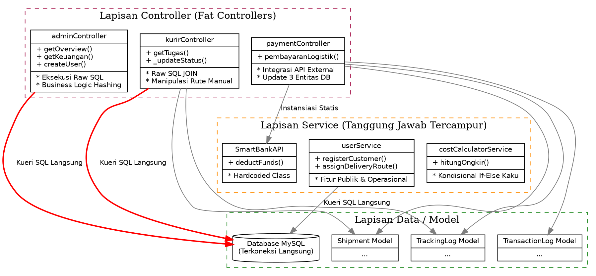
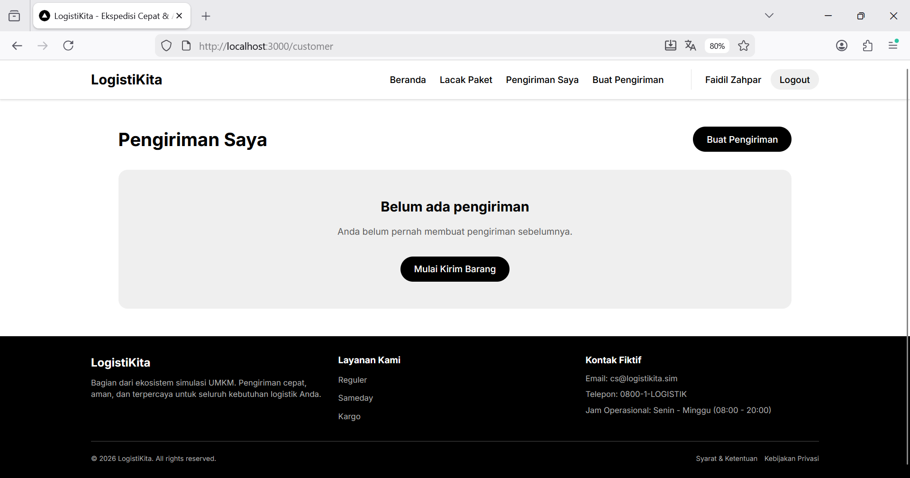
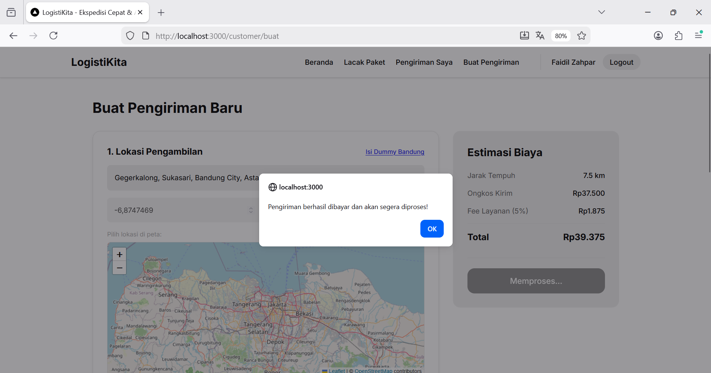
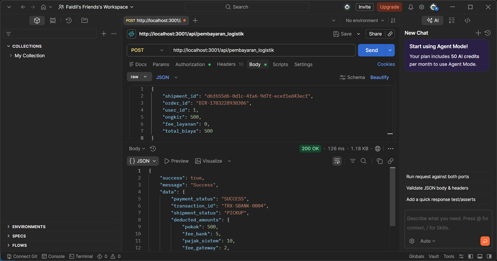
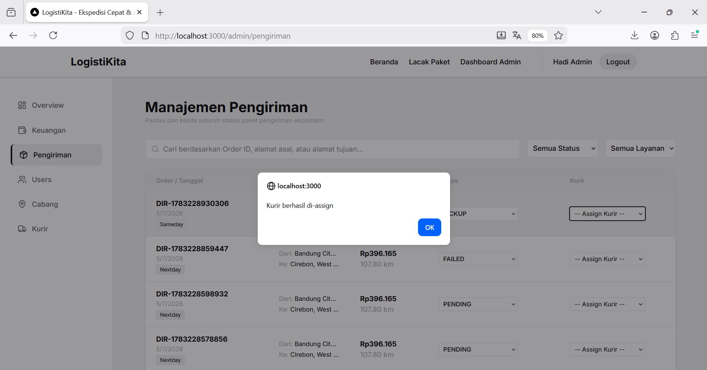
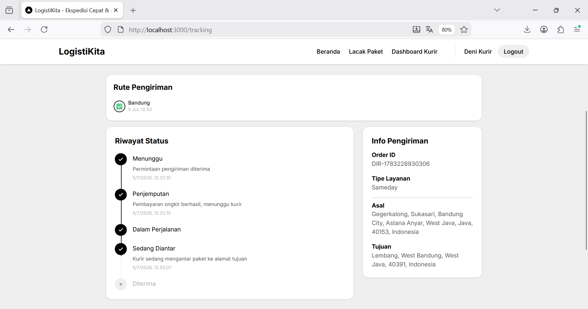
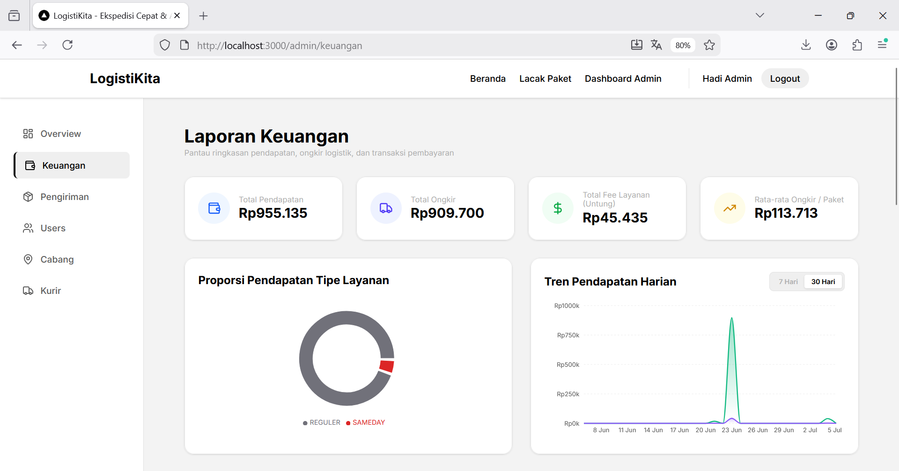

# Laporan Analisis dan Refactoring Kode
Platform LogistiKita

| Jenis Dokumen | Contoh laporan proyek aplikasi web |
|---|---|
| Topik | MVC, SOLID, Clean Code, High Cohesion, Low Coupling |
| Sumber Observasi | LogistiKita - Node.js Express MVC & React |
| Tanggal | 4 Juli 2026 |

Dokumen ini disusun sebagai laporan proyek untuk topik analisis dan refactoring kode aplikasi web. Studi kasus yang digunakan adalah LogistiKita, yaitu platform pengiriman dan manajemen logistik yang menjadi bagian dari ekosistem ekonomi UMKM.

## 1. Identitas Proyek

| Komponen | Isi |
|---|---|
| Nama Aplikasi | Platform LogistiKita |
| Jenis Aplikasi | Aplikasi Web |
| Pola Arsitektur | MVC Node.js (Backend) dan Next.js (Frontend) |
| Topik Praktikum | MVC, SOLID, Clean Code, High Cohesion, Low Coupling |
| Nama Kelompok | Kelompok 5 - LogistiKita |
| Anggota Kelompok | Faidil Zahpar (714240007), Fachri Zikrisyah (714251021), Aditya Firmansyah (714240015) |
| Repository | https://github.com/fachrizikrisyah231-create/LogistiKita |
| Sumber Observasi Kode | direktori lokal backend/src/ |
| Tanggal Revisi | 4 Juli 2026 |

## 2. Deskripsi Singkat Aplikasi

LogistiKita merupakan aplikasi web berbasis JavaScript (Node.js/Express dan React/Next.js) dengan database MySQL yang berperan sebagai *cost driver* untuk memastikan distribusi barang. Aplikasi ini digunakan untuk mengelola pengiriman barang, di mana setelah transaksi berhasil (dipicu otomatis oleh Marketplace/Supplier atau secara manual oleh kustomer), sistem akan menghitung ongkir, meminta integrasi pembayaran ongkir melalui SmartBank, dan meng-*update* status pengiriman kurir. Aplikasi ini tidak mengelola pembayaran langsung, melainkan hanya melakukan *request payment* ongkir ke SmartBank.

## 3. Tujuan Refactoring

Refactoring pada studi kasus ini bertujuan untuk:
1) Memperjelas pemisahan tanggung jawab antara *controller*, *model*, *service*, dan rute HTTP.
2) Mengurangi *controller* yang terlalu gemuk dalam menangani proses sekaligus (validasi, skoring ongkir, kueri database).
3) Memisahkan logika manipulasi pembaruan rute pengiriman dan pencatatan histori *tracking* agar tidak berulang (*DRY*).
4) Memindahkan struktur kueri agregat atau laporan keuangan spesifik dari *controller* ke *repository* atau layanan bisnis khusus.
5) Mengurangi keterikatan keras (*hardcoded coupling*) kode terhadap kelas pihak eksternal, dan membuat arsitektur lebih kokoh untuk pengujian.
6) Menstandarisasi format pelemparan *error* (*Exception*) sehingga respons HTTP berjalan konsisten tanpa merusak abstraksi.
7) Mengimplementasikan struktur *strategy pattern* atau hierarki untuk validasi rute pengiriman, agar mematuhi perluasan fungsional (OCP dan LSP).

## 4. Ruang Lingkup Analisis Kode

Analisis difokuskan pada area *backend* Node.js, terutama pada fungsionalitas lapisan *Controller* dan *Service* pendukungnya. Modul-modul yang menjadi ruang lingkup utama *refactoring* meliputi:

| No | Modul | File/Method | Alasan Dipilih |
|---|---|---|---|
| 1 | Dashboard Admin | `adminController.js::getOverview()` | Controller memuat banyak baris kueri SQL agregasi untuk laporan, mencampur akses data langsung dengan respons HTTP. |
| 2 | Perhitungan Biaya Pengiriman | `costCalculatorService.js::hitungOngkir()` | Percabangan *if-else* bertingkat untuk setiap layanan, menyulitkan ekstensi penambahan armada tipe baru. |
| 3 | Manajemen User & Kurir | `userService.js::assignDeliveryRoute()` | Kelas *Service* mencampuradukkan fitur autentikasi kustomer biasa dengan logika rute operasional kurir. |
| 4 | Pemrosesan Pembayaran | `paymentService.js::processLogisticsPayment()` | Logika kelas tingkat tinggi bergantung dan memanggil (*hardcoded*) kelas spesifik penyedia API (*SmartBank*) secara statis. |
| 5 | Update Status Kurir | `kurirController.js::_updateStatus()` | *God Method* yang menumpuk aturan otorisasi, penulisan riwayat *tracking*, kalkulasi transisi rute, dan manipulasi *database* utama. |
| 6 | Transaksi Pembayaran | `paymentController.js::pembayaranLogistik()` | *Fat Controller* yang mengatur orkestrasi 3 entitas *database* berbeda secara manual usai menerima respons dari API. |
| 7 | Agregasi Laporan Keuangan | `adminController.js::getKeuangan()` | Komputasi bisnis finansial dan baris eksekusi *query* tergabung jadi satu di lapisan *routing*. |
| 8 | Orkestrasi Histori Paket | `trackingController.js::getTracking()` | Merangkai penggabungan relasi tabel pencarian riwayat paket secara paksa di antarmuka HTTP. |
| 9 | Layanan Inti Pemesanan | `shipmentService.js::processShipmentRequest()` | Terdapat batasan logika jarak spesifik yang di-*hardcode*, gagal memenuhi prinsip penambahan armada secara dinamis. |
| 10 | Standarisasi Format Error | `costCalculatorService.js` (Layanan) | Ketidakkonsistenan tipe *Exception* mencederai kontrak *Error Handling* di sisi antarmuka (*Controller*). |

## 5. Struktur Folder Aplikasi

Struktur aktual yang mendominasi operasi yang dianalisis dari *repository*:

```text
logistikita/
|-- backend/
|   |-- src/
|   |   |-- controllers/
|   |   |   |-- adminController.js
|   |   |   |-- costController.js
|   |   |   |-- kurirController.js
|   |   |   |-- shipmentController.js
|   |   |   |-- paymentController.js
|   |   |   |-- trackingController.js
|   |   |-- middleware/
|   |   |-- models/
|   |   |-- routes/
|   |   |   |-- logistikitaRoutes.js
|   |   |-- services/
|   |   |   |-- costCalculatorService.js
|   |   |   |-- ...
|   |   |-- utils/
|   |   |-- app.js
|   |   |-- server.js
```

## 6. Ringkasan Arsitektur MVC

Aplikasi menggunakan pola arsitektur MVC sederhana pada sisi *backend* berbasis Node.js/Express, dengan pengaturan *router* utama pada subfolder `routes/`.

| Lapisan | Contoh File | Tanggung Jawab Saat Ini |
|---|---|---|
| Entry Point | `server.js`, `app.js` | Menginisialisasi *server* Express, memuat *middleware* antarmuka global, dan menyambungkan *database*. |
| Router | `logistikitaRoutes.js` | Memetakan *endpoint* URL ke *controller* dan menerapkan validasi lapisan awal (JWT *auth*). |
| Controller | `adminController.js`, `kurirController.js` | Pusat alur eksekusi: menerima beban *request*, memanggil data, dan mengirimkan kompilasi JSON *response*. |
| Model | `Shipment.js`, `User.js` | Modul yang mewakili manipulasi tabel dan memfasilitasi interaksi langsung ke skema MySQL. |
| Service | `costCalculatorService.js` | Tempat pembungkus fungsi kalkulasi independen (seperti penghitungan jarang lintang-bujur). |

**Ringkasan alur utama:**
1) Kustomer atau sistem eksternal (Marketplace/SupplierHub) membuat pesanan pengiriman melalui `shipmentController`.
2) Sistem secara otomatis memanggil `costCalculatorService` untuk menghitung ongkos kirim.
3) Sistem memanggil `paymentService` untuk meneruskan permintaan potong saldo ke SmartBank.
4) Jika pembayaran disetujui, pesanan dicatat ke *database* dan dialokasikan ke cabang transit awal (`PENDING`/`PICKUP`).
5) Kurir mengambil paket dan menekan tombol *update* status secara bertahap lewat aplikasi kurir (`kurirController`).
6) Dasbor admin dan publik (*tracking*) mengambil pembaruan riwayat status tersebut dari *database*.

## 7. Daftar Temuan Masalah Kode

| No | File/Method | Masalah Kode | Prinsip Terkait | Dampak Negatif |
|---|---|---|---|---|
| 1 | `backend/src/controllers/adminController.js` <br> `getOverview()` | Controller menampung banyak baris *query* SQL agregasi secara langsung dan membentuk data laporan. | SRP, High Cohesion, MVC | Controller menjadi sangat gemuk (*Fat Controller*). Sulit untuk melakukan pengujian data tanpa mensimulasikan panggilan HTTP. |
| 2 | `backend/src/services/costCalculatorService.js` <br> `hitungOngkir()` | Menggunakan percabangan `if-else` bertingkat untuk menghitung biaya berdasarkan tiap jenis pengiriman (Reguler, Sameday, Nextday). | OCP, Clean Code | Menambah tipe pengiriman baru akan memaksa kita memodifikasi ulang kode yang sudah stabil. |
| 3 | `backend/src/services/userService.js` <br> `assignDeliveryRoute()` | Kelas `UserService` melayani pendaftaran kustomer dan sekaligus memuat logika penugasan rute pengiriman kurir. | ISP, Separation of Concerns | Kustomer biasa terikat pada fitur rute kurir yang tidak pernah mereka butuhkan. |
| 4 | `backend/src/services/paymentService.js` <br> `processLogisticsPayment()` | Logika layanan secara langsung menginisialisasi kelas penyedia spesifik (`new SmartBankAPI()`) di dalam fungsinya. | DIP, Low Coupling | Sistem terikat kuat (*tightly coupled*) dengan satu penyedia pembayaran. Sangat sulit jika ingin bermigrasi ke penyedia lain. |
| 5 | `backend/src/controllers/kurirController.js` <br> `_updateStatus()` | Menyatukan otorisasi, perubahan pengiriman, pembuatan histori *tracking*, dan penentuan logika transisi rute dalam satu alur besar. | SRP, High Cohesion | Fungsi membesar secara tumpang tindih (*God Method*). Perubahan pada alur rute atau *tracking* rawan menciptakan cacat (*bug*) tambahan. |
| 6 | `backend/src/controllers/paymentController.js` <br> `pembayaranLogistik()` | Controller menangani logika HTTP, pemanggilan gateway, sekaligus orkestrasi pembaruan state pada tiga entitas database berbeda secara manual. | SRP, High Cohesion | Controller terlalu gemuk (*Fat Controller*). Kegagalan pada salah satu operasi database sulit ditangani di dalam controller. |
| 7 | `backend/src/controllers/adminController.js` <br> `getKeuangan()` | Mengeksekusi banyak kueri SQL agregasi untuk laporan keuangan dan menyisipkan manipulasi data di dalam fungsi HTTP. | SRP, MVC Pattern | Logika komputasi laporan keuangan bercampur dengan HTTP, mempersulit pengujian unit dan daur ulang kode. |
| 8 | `backend/src/controllers/trackingController.js` <br> `getTracking()` | Memanggil beberapa model lalu merangkai relasi data *tracking* secara manual di Controller. | SRP, High Cohesion | Logika penggabungan relasi menjadi terpusat di entri *web*, tidak dapat didaur ulang jika sistem lain butuh data serupa. |
| 9 | `backend/src/services/shipmentService.js` <br> `processShipmentRequest()` | Terdapat percabangan kondisional kaku (hardcoded) untuk memvalidasi batas jarak maksimum berdasarkan tipe pengiriman spesifik (Sameday/Nextday). | LSP, OCP | Tipe pengiriman tidak memiliki sifat substitusi yang mandiri. Menambah layanan baru mewajibkan modifikasi *ShipmentService*. |
| 10 | `backend/src/services/costCalculatorService.js` (dan Service lainnya) | Melempar objek `Error` standar tanpa properti HTTP `status`, berbeda dengan service lain yang menyertakan atribut tersebut secara tak beraturan. | LSP (Exception Rule) | Ketidakkonsistenan kontrak *error* menyebabkan antarmuka penangkap (Controller) gagal merespon status HTTP secara presisi (biasa *default* ke 500). |
| 11 |  |  |  |  |
| 12 |  |  |  |  |
| 13 |  |  |  |  |
| 14 |  |  |  |  |
| 15 |  |  |  |  |

## 8. Analisis Before-After Refactoring

### 8.1 Temuan 1 - Query Dashboard Admin Terlalu Banyak di Controller

- **Lokasi Kode**: `backend/src/controllers/adminController.js` dan method `getOverview()`
- **Kode Sebelum Refactoring**:
```javascript
async getOverview(req, res) {
  try {
    const [[{ total_pengiriman }]] = await db.query('SELECT COUNT(*) as total_pengiriman FROM shipments');
    const [[{ pengiriman_aktif }]] = await db.query('SELECT COUNT(*) as pengiriman_aktif FROM shipments WHERE status NOT IN ("DELIVERED", "FAILED")');
    const [[{ total_revenue }]] = await db.query('SELECT SUM(fee_layanan) as total_revenue FROM shipments WHERE status = "DELIVERED"');
    
    respond.success(res, 'Admin Overview', { total_pengiriman, pengiriman_aktif, total_revenue });
  } catch (err) {
    respond.error(res, 'FETCH_FAILED', err.message, 500);
  }
}
```
- **Masalah yang Ditemukan**: Controller bertugas ganda menangani siklus interaksi HTTP (*request-response*) dan sekaligus berfungsi sebagai tempat penyimpanan struktur *query* SQL agregat yang kompleks.
- **Prinsip yang Dilanggar**:
  1. Single Responsibility Principle (SRP): Controller menangani lebih dari satu tanggung jawab (HTTP dan Database).
  2. MVC Pattern Violation: Logika *query* yang seharusnya menjadi ranah Model/Repository bocor hingga ke Controller.
- **Strategi Refactoring**:
  1. Buat layer abstraksi tambahan bernama `AdminDashboardService` (atau Repository).
  2. Pindahkan seluruh detail eksekusi query agregat SQL ke dalam `AdminDashboardService`.
  3. Controller hanya melakukan pemanggilan fungsi dari *Service* tersebut lalu merespons kepada *client*.
- **Kode Sesudah Refactoring**:
```javascript
// backend/src/controllers/adminController.js
const adminDashboardService = require('../services/adminDashboardService');

async getOverview(req, res) {
  try {
    const overviewData = await adminDashboardService.getOverviewStats();
    respond.success(res, 'Admin Overview', overviewData);
  } catch (err) {
    respond.error(res, 'FETCH_FAILED', err.message, 500);
  }
}

// backend/src/services/adminDashboardService.js
class AdminDashboardService {
  async getOverviewStats() {
    const [[{ total_pengiriman }]] = await db.query('SELECT COUNT(*) as total_pengiriman FROM shipments');
    const [[{ total_revenue }]] = await db.query('SELECT SUM(fee_layanan) as total_revenue FROM shipments WHERE status = "DELIVERED"');
    
    return { total_pengiriman, total_revenue };
  }
}
module.exports = new AdminDashboardService();
```
- **Dampak Perbaikan**: Controller menjadi sangat rapi dan bersih. Apabila skema tabel database untuk dashboard berubah esok hari, tidak akan ada perubahan pada kerangka HTTP Controller, melainkan hanya di Service.

### 8.2 Temuan 2 - Percabangan If-Else yang Menumpuk untuk Biaya Pengiriman

- **Lokasi Kode**: `backend/src/services/costCalculatorService.js` dan method `hitungOngkir()`
- **Kode Sebelum Refactoring**:
```javascript
class CostCalculatorService {
  hitungOngkir(tipe, jarak, berat) {
    if (tipe === 'sameday') {
      return (jarak * 5000) + (berat * 2000);
    } else if (tipe === 'nextday') {
      return (jarak * 3000) + (berat * 1500);
    } else if (tipe === 'reguler') {
      return (jarak * 2000) + (berat * 1000);
    }
    throw new Error('Tipe pengiriman tidak valid');
  }
}
```
- **Masalah yang Ditemukan**: Fungsi kalkulasi memuat logika yang terikat kuat pada daftar layanan secara kaku (*hardcoded*). Jika fitur pengiriman baru (seperti "Kargo Ekstra Besar") ditambahkan, fungsi ini harus dibongkar dan dimodifikasi lagi.
- **Prinsip yang Dilanggar**:
  1. Open/Closed Principle (OCP): Kelas tidak tertutup dari modifikasi ketika ada ekstensi fitur baru.
  2. Clean Code: Terjadinya tumpukan blok kondisi (*Switch/If-Else smell*).
- **Strategi Refactoring**:
  1. Terapkan *Strategy Pattern* dengan membuat kelas antarmuka konseptual untuk `ShippingStrategy`.
  2. Ekstrak perhitungan setiap layanan ke kelas terpisah (`SamedayStrategy`, `RegulerStrategy`).
  3. Lakukan inisiasi pemetaan (*Map/Dictionary*) agar Service bisa memanggil perhitungan secara polimorfisme.
- **Kode Sesudah Refactoring**:
```javascript
// backend/src/services/shippingStrategies.js
class SamedayStrategy {
  calculate(jarak, berat) { return (jarak * 5000) + (berat * 2000); }
}
class RegulerStrategy {
  calculate(jarak, berat) { return (jarak * 2000) + (berat * 1000); }
}

// backend/src/services/costCalculatorService.js
const strategies = {
  sameday: new SamedayStrategy(),
  reguler: new RegulerStrategy()
};

class CostCalculatorService {
  hitungOngkir(tipe, jarak, berat) {
    const strategy = strategies[tipe];
    if (!strategy) throw new Error('Tipe pengiriman tidak valid');
    return strategy.calculate(jarak, berat);
  }
}
```
- **Dampak Perbaikan**: Penambahan fitur tipe pengiriman baru tidak lagi memodifikasi file `costCalculatorService.js` yang sudah diuji stabil. Kita hanya perlu mendaftarkan *class* strategi yang baru.

### 8.3 Temuan 3 - Fat Service (Fungsi Kurir dan Kustomer Digabung)

- **Lokasi Kode**: `backend/src/services/userService.js` dan method `assignDeliveryRoute()`
- **Kode Sebelum Refactoring**:
```javascript
class UserService {
  async registerCustomer(userData) { /* logika daftar kustomer */ }
  async resetPassword(email) { /* logika reset sandi */ }
  
  // Metode khusus Kurir
  async assignDeliveryRoute(kurirId, routeData) {
    await db.query('INSERT INTO shipment_routes ...', [kurirId, routeData]);
  }
}
```
- **Masalah yang Ditemukan**: Kelas `UserService` terlalu membengkak (Fat Class). Kelas ini menampung fungsionalitas manajemen autentikasi Kustomer umum sekaligus mengurus logika operasional teknis yang murni eksklusif untuk Kurir logistik.
- **Prinsip yang Dilanggar**:
  1. Interface Segregation Principle (ISP): Modul atau entitas yang menggunakan layanan kustomer dipaksa memiliki kebergantungan parsial pada modul kurir.
  2. High Cohesion: Kode dalam kelas ini memiliki tujuan yang bercabang dan tidak menyatu (kurang kohesif).
- **Strategi Refactoring**:
  1. Pecah `UserService` menjadi layanan yang berfokus ke perannya.
  2. Buat `CustomerAuthService` khusus untuk registrasi/sandi.
  3. Buat `KurirOperationService` dan pindahkan metode `assignDeliveryRoute` secara eksklusif ke sana.
- **Kode Sesudah Refactoring**:
```javascript
// backend/src/services/customerAuthService.js
class CustomerAuthService {
  async registerCustomer(userData) { /* logika daftar kustomer */ }
  async resetPassword(email) { /* logika reset sandi */ }
}

// backend/src/services/kurirOperationService.js
class KurirOperationService {
  async assignDeliveryRoute(kurirId, routeData) {
    await db.query('INSERT INTO shipment_routes ...', [kurirId, routeData]);
  }
}
```
- **Dampak Perbaikan**: Pemisahan yang tegas membuat pemeliharaan fitur operasional kurir sama sekali tidak akan menanggung risiko mengganggu *bug* pada fitur pendaftaran/profil kustomer biasa.

### 8.4 Temuan 4 - Inisiasi Hardcoded ke Pihak Ketiga (Payment Gateway)

- **Lokasi Kode**: `backend/src/services/paymentService.js` dan method `processLogisticsPayment()`
- **Kode Sebelum Refactoring**:
```javascript
const SmartBankAPI = require('../third-party/SmartBankAPI');

class PaymentService {
  async processLogisticsPayment(orderId, amount) {
    const gateway = new SmartBankAPI(); // Keterikatan langsung (Hardcoded)
    const result = await gateway.deductFunds(amount);
    return result;
  }
}
```
- **Masalah yang Ditemukan**: Kelas tingkat tinggi (`PaymentService`) secara statis membentuk *instance* dari pustaka pembayaran spesifik (`SmartBankAPI`). Ini berarti LogistiKita tidak fleksibel jika sewaktu-waktu ingin beralih dari SmartBank ke penyedia lain (misalnya Midtrans).
- **Prinsip yang Dilanggar**:
  1. Dependency Inversion Principle (DIP): Modul tingkat tinggi (*High-level*) bergantung pada detail modul tingkat rendah (*Low-level/Concrete class*).
  2. Low Coupling: *Tightly coupled* terhadap kelas eksternal.
- **Strategi Refactoring**:
  1. Buat abstraksi desain untuk *gateway* pembayaran, dan terapkan injeksi ketergantungan (*Dependency Injection*) pada konstruktor `PaymentService`.
  2. Sisipkan implementasi konkret (contohnya kelas adapter dari *SmartBank* atau *Midtrans*) melalui *framework* saat layanan diinjeksi.
- **Kode Sesudah Refactoring**:
```javascript
// backend/src/services/paymentService.js
class PaymentService {
  // gateway mematuhi abstraksi/interface (misal method pay())
  constructor(paymentGatewayAdapter) {
    this.gateway = paymentGatewayAdapter; 
  }

  async processLogisticsPayment(orderId, amount) {
    // Bergantung pada abstraksi
    const result = await this.gateway.pay(amount);
    return result;
  }
}

// Inisialisasi di tempat lain (Misal: Dependency Container)
// const activeGateway = new SmartBankAdapter();
// const paymentService = new PaymentService(activeGateway);
```
- **Dampak Perbaikan**: Modul pembayaran kini kebal terhadap perubahan *vendor* pembayaran pihak ketiga. Kita bisa melakukan pergantian *Gateway* secara dinamis tanpa menyentuh dan berisiko merusak logika di dalam `PaymentService`.

### 8.5 Temuan 5 - God Method pada Update Status Kurir

- **Lokasi Kode**: `backend/src/controllers/kurirController.js` dan method `_updateStatus()`
- **Kode Sebelum Refactoring**:
```javascript
  async _updateStatus(req, res, status, requiredCurrentStatus, successMessage) {
    // ... validasi & otorisasi user ...
    await db.query(`UPDATE shipments SET status = ? WHERE id = ?`, [status, id]);
    await db.query('INSERT INTO tracking_logs ...', [id, status, keterangan]);

    if (status === 'AT_BRANCH' && branch_id) {
      await ShipmentRoute.updateArrived(id, branch_id);
    }
    if (status === 'IN_TRANSIT' && shipment.status === 'AT_BRANCH') {
      await ShipmentRoute.updateDeparted(id, shipment.current_branch_id);
    }
    respond.success(res, successMessage, { shipment_id: id, status });
  }
```
- **Masalah yang Ditemukan**: Method `_updateStatus` bertindak sebagai *God Method*. Fungsi ini menangani otorisasi *user*, modifikasi model *shipments*, penulisan *tracking logs*, serta penentuan logika *routing* secara spesifik (jika *AT_BRANCH* lakukan ini, jika *IN_TRANSIT* lakukan itu) di ranah HTTP Controller.
- **Prinsip yang Dilanggar**:
  1. Single Responsibility Principle (SRP): Fungsi ini mengambil alih 4 tanggung jawab sekaligus dalam satu tempat.
  2. High Cohesion: Kode dalam fungsi ini berantakan (*scattered*) karena menyentuh terlalu banyak domain (Rute, Histori, Pengiriman) di luar tanggung jawab *Controller* utamanya.
- **Strategi Refactoring**:
  1. Buat layer abstraksi tambahan bernama `ShipmentUpdateService`.
  2. Ekstrak operasi validasi rute, pembuatan *tracking log*, dan pembaruan pengiriman menjadi fungsi transaksional yang utuh di dalam *Service*.
  3. Controller murni hanya berfungsi sebagai penerima beban HTTP (*request/response*) dan memanggil eksekusi layanan tersebut.
- **Kode Sesudah Refactoring**:
```javascript
// backend/src/controllers/kurirController.js
  async _updateStatus(req, res, status, requiredCurrentStatus, successMessage) {
    try {
      await shipmentUpdateService.updateStatus({
        shipmentId: req.params.id,
        kurirId: req.user.id,
        newStatus: status,
        branchId: req.body.branch_id,
        keterangan: req.body.keterangan || successMessage,
        requiredCurrentStatus
      });
      respond.success(res, successMessage, { shipment_id: req.params.id, status });
    } catch (err) {
      respond.error(res, err.code || 'UPDATE_FAILED', err.message, 500);
    }
  }
```
- **Dampak Perbaikan**: Kepaduan (*cohesion*) pada *controller* HTTP meningkat drastis. Perubahan logika aturan rute (*routing*) atau format penulisan log sistem di masa depan tidak lagi merusak *controller* HTTP, melainkan dapat diatur terpusat di `ShipmentUpdateService`.

### 8.6 Temuan 6 - God Method pada Payment Controller (Orkestrasi Database di Controller)

- **Lokasi Kode**: `backend/src/controllers/paymentController.js` dan method `pembayaranLogistik()`
- **Kode Sebelum Refactoring**:
```javascript
// ... setelah processPayment via gateway sukses
await Shipment.updateStatus(order_id, 'PICKUP', result.data.transaction_id);
await TrackingLog.insert(shipment_id, 'PICKUP', 'Pembayaran ongkir berhasil, menunggu kurir');
await TransactionLog.insertSuccess({ /* payload riwayat transaksi... */ });
return respond.success(res, { /* response data */ });
```
- **Masalah yang Ditemukan**: Controller bertindak sebagai "God Method" yang secara manual mengatur pembaruan state pada tiga entitas database berbeda (`Shipment`, `TrackingLog`, `TransactionLog`) setelah berinteraksi dengan API gateway.
- **Prinsip yang Dilanggar**: Single Responsibility Principle (SRP) dan High Cohesion. Logika bisnis persisten pasca-pembayaran bercampur dengan logika HTTP.
- **Strategi Refactoring**: Pindahkan seluruh orkestrasi pembaruan state database ke dalam sebuah *Service* khusus (misal `PaymentResultService`), atau delegasikan hal ini sebagai lanjutan operasi di `smartbankService`. Controller murni memanggil layanan tersebut lalu mengembalikan hasil HTTP.
- **Kode Sesudah Refactoring**:
```javascript
// backend/src/controllers/paymentController.js
const result = await paymentOrchestratorService.processPaymentAndLog(req.body, user_id);
if (result.success) {
  return respond.success(res, result.data);
} else {
  return respond.error(res, 'PAYMENT_FAILED', result.message, 402, result.error);
}
```
- **Dampak Perbaikan**: Pemisahan tanggung jawab yang jelas. Controller menjadi sangat ramping (*thin controller*), dan logika transaksi mutasi *database* terpusat sehingga jauh lebih aman serta mudah diuji (testable).

### 8.7 Temuan 7 - Query Agregasi Keuangan Kompleks Terikat di Controller

- **Lokasi Kode**: `backend/src/controllers/adminController.js` dan method `getKeuangan()`
- **Kode Sebelum Refactoring**:
```javascript
async getKeuangan(req, res) {
  const [[totals]] = await db.query(`SELECT SUM(amount) as total_pendapatan...`);
  const [typeRows] = await db.query(`SELECT s.tipe_pengiriman, SUM(t.amount)...`);
  // Logika perulangan for untuk mengisi tanggal kosong (fill missing dates)
  // ...
  respond.success(res, 'Data Keuangan', { ... });
}
```
- **Masalah yang Ditemukan**: Fungsi mengeksekusi beragam kueri SQL agregasi finansial rumit dan melakukan manipulasi iterasi array (seperti logika pengisian tanggal *missing dates*) langsung secara gamblang di dalam layer HTTP.
- **Prinsip yang Dilanggar**: MVC Pattern Violation dan SRP. Layer HTTP mengatur dan memproses langsung logika kalkulasi statistik bisnis.
- **Strategi Refactoring**: Buat `AdminFinanceService` yang membungkus seluruh tahap kueri (*database fetch*) hingga perakitan tren data harian ke dalam satu fungsi abstraksi penuh.
- **Kode Sesudah Refactoring**:
```javascript
// backend/src/controllers/adminController.js
async getKeuangan(req, res) {
  try {
    const dataKeuangan = await adminFinanceService.generateFinanceReport();
    respond.success(res, 'Data Keuangan', dataKeuangan);
  } catch (err) {
    respond.error(res, 'FETCH_FAILED', err.message, 500);
  }
}
```
- **Dampak Perbaikan**: Kode Controller bebas dari "Fat Controller". Merubah kerangka tabel kalkulasi atau format perhitungan tren laporan keuangan tidak akan memaksa sentuhan apa pun ke ranah API/Routing di depannya.

### 8.8 Temuan 8 - Controller Manual Merangkai Data Relasional (Tracking)

- **Lokasi Kode**: `backend/src/controllers/trackingController.js` dan method `getTracking()`
- **Kode Sebelum Refactoring**:
```javascript
const shipment = await Shipment.findByOrderId(order_id);
const riwayat = await TrackingLog.findByShipmentId(shipment.id);
const ruteCabang = await ShipmentRoute.getByShipmentId(shipment.id);
return respond.success(res, 'Data tracking', { ...shipment, riwayat, ruteCabang });
```
- **Masalah yang Ditemukan**: Controller memanggil tiga model berbeda secara independen dan menyusun (stitching) relasi kompleks data *tracking* itu menjadi satu kesatuan objek pelaporan manual.
- **Prinsip yang Dilanggar**: High Cohesion dan SRP. Pembentukan paket relasi *domain* bisnis sebaiknya bukan tanggung jawab agen pemandu interaksi HTTP.
- **Strategi Refactoring**: Sediakan fungsi mandiri di dalam layer `TrackingService` (misal `getFullTrackingData()`) yang merangkai dan menjamin keutuhan data relasional tersebut sebelum diserahkan ke *caller*.
- **Kode Sesudah Refactoring**:
```javascript
// backend/src/controllers/trackingController.js
async getTracking(req, res) {
  try {
    const trackingData = await trackingService.getFullTrackingData(req.params.order_id);
    return respond.success(res, 'Data tracking', trackingData);
  } catch (err) {
    return respond.error(res, err.code, err.message, err.status);
  }
}
```
- **Dampak Perbaikan**: Pembuatan data historis lengkap menjadi entitas tunggal di dalam layer logikanya. Jika ada platform lain (seperti *cron job* atau modul admin) yang membutuhkan payload paket serupa, fungsi abstraksi tersebut dapat didaur ulang seketika.

### 8.9 Temuan 9 - Pelanggaran LSP pada Validasi Jarak Layanan Pengiriman

- **Lokasi Kode**: `backend/src/services/shipmentService.js` dan method `processShipmentRequest()`
- **Kode Sebelum Refactoring**:
```javascript
// Validasi batas jarak berdasarkan tipe secara statis dan hardcoded
if (tipePengiriman === 'sameday' && jarakKm > maxSameday) {
  const err = new Error(`Jarak terlalu jauh untuk Sameday...`);
  err.status = 400; throw err;
}
if (tipePengiriman === 'nextday' && jarakKm > maxNextday) {
  const err = new Error(`Jarak terlalu jauh untuk Nextday...`);
  err.status = 400; throw err;
}
```
- **Masalah yang Ditemukan**: `ShipmentService` menggunakan pemeriksaan tipe (*type-checking*) bersyarat secara eksplisit untuk mengetahui apakah kelas/tipe pengiriman turunan dapat melayani rute. Kelas-kelas strategi layanan (*subtipe* fungsional) ini tidak murni mensubstitusi abstraksinya secara polimorfik.
- **Prinsip yang Dilanggar**: Liskov Substitution Principle (LSP) dan Open/Closed Principle (OCP). Subtipe tidak benar-benar substitutabel jika fungsi *caller* harus mengerti detail internal dan mensyaratkan inspeksi jenis subtipe yang sedang digunakan.
- **Strategi Refactoring**: Delegasikan tugas validasi ini ke instansi kelas strategi pengiriman masing-masing (*Strategy Pattern*). Panggil metode abstraksi secara umum tanpa mengamati wujud tipenya.
- **Kode Sesudah Refactoring**:
```javascript
// backend/src/services/shipmentService.js
// strategy didefinisikan berdasarkan tipePengiriman
const shippingStrategy = ShippingStrategyFactory.getStrategy(tipePengiriman);

// LSP ditegakkan, service percaya penuh pada kontrak metode validateDistance
shippingStrategy.validateDistance(jarakKm);
```
- **Dampak Perbaikan**: Ekstensi tipe pengiriman masa depan dapat disubstitusikan ke dalam kode eksisting (*plug and play*) tanpa memerlukan modifikasi pada logika pembungkus utamanya.

### 8.10 Temuan 10 - Pelanggaran LSP pada Penanganan Error Berbagai Service (Inconsistent Contract)

- **Lokasi Kode**: `backend/src/services/costCalculatorService.js` vs service lain (seperti `shipmentService.js`)
- **Kode Sebelum Refactoring**:
```javascript
// Di dalam costCalculatorService.js
throw new Error('Tipe pengiriman tidak valid'); // Standard error, tanpa properti tambahan

// Di tempat terpisah, misal shipmentService.js
const err = new Error('Jarak terlalu jauh...');
err.status = 400; 
throw err; // Custom error property
```
- **Masalah yang Ditemukan**: Penanganan kegagalan (*Exception/Error Throwing*) pada berbagai fungsi internal dan *Service* melemparkan obyek eksepsi dengan struktur spesifikasi dan properti tambahan yang tidak konsisten.
- **Prinsip yang Dilanggar**: Liskov Substitution Principle (LSP). Dalam kaitannya dengan pola *Exception*, objek turunan atau *service* pengganti dari suatu antarmuka harus mematuhi ekspektasi standar yang sama terkait *error handling*, agar blok penangkap (`catch`) di lapis atasnya bekerja mulus.
- **Strategi Refactoring**: Bangun abstraksi antarmuka *Error* global. Perintahkan sistem agar senantiasa melempar turunan pengecualian (`AppError` atau `HttpError`) dengan properti dan penandatanganan metode yang seragam.
- **Kode Sesudah Refactoring**:
```javascript
// backend/src/utils/AppError.js
class AppError extends Error {
  constructor(message, status) {
    super(message);
    this.status = status;
  }
}

// backend/src/services/costCalculatorService.js
throw new AppError('Tipe pengiriman tidak valid', 400); // Konsisten dan Tersubstitusi
```
- **Dampak Perbaikan**: Ketika *Controller HTTP* menerima tangkapan galat (*catch error*), parameter `err.status` dapat diandalkan ada secara seragam pada seluruh jenis objek pelanggaran di sub-levelnya, mencegah *crash* fatal dan menjamin balasan 500 (*Internal Server Error*) yang sejati.

### 8.11 Temuan 11
- **Lokasi Kode**: 
- **Kode Sebelum Refactoring**:
- **Masalah yang Ditemukan**: 
- **Prinsip yang Dilanggar**: 
- **Strategi Refactoring**: 
- **Kode Sesudah Refactoring**:
- **Dampak Perbaikan**: 

### 8.12 Temuan 12
- **Lokasi Kode**: 
- **Kode Sebelum Refactoring**:
- **Masalah yang Ditemukan**: 
- **Prinsip yang Dilanggar**: 
- **Strategi Refactoring**: 
- **Kode Sesudah Refactoring**:
- **Dampak Perbaikan**: 

### 8.13 Temuan 13
- **Lokasi Kode**: 
- **Kode Sebelum Refactoring**:
- **Masalah yang Ditemukan**: 
- **Prinsip yang Dilanggar**: 
- **Strategi Refactoring**: 
- **Kode Sesudah Refactoring**:
- **Dampak Perbaikan**: 

### 8.14 Temuan 14
- **Lokasi Kode**: 
- **Kode Sebelum Refactoring**:
- **Masalah yang Ditemukan**: 
- **Prinsip yang Dilanggar**: 
- **Strategi Refactoring**: 
- **Kode Sesudah Refactoring**:
- **Dampak Perbaikan**: 

### 8.15 Temuan 15
- **Lokasi Kode**: 
- **Kode Sebelum Refactoring**:
- **Masalah yang Ditemukan**: 
- **Prinsip yang Dilanggar**: 
- **Strategi Refactoring**: 
- **Kode Sesudah Refactoring**:
- **Dampak Perbaikan**: 

## 9. Class Diagram Sebelum Refactoring

Diagram berikut menggambarkan kondisi ringkas sistem sebelum *refactoring*. Setiap *class* di *backend* ditulis dalam format hierarki untuk menunjukkan *dependency* fungsionalnya. Pada kondisi inisial ini, lapisan *controller* acapkali ditarik sebagai pusat gravitasi koordinasi (memuat siklus HTTP *request*, akses *database* masif, operasi keamanan JWT, hingga logika *payment*). Oleh karenanya, tingkat *coupling* operasional antara *controller* dengan model basis data sangat rapat dan sulit dibongkar (*monolithic function*).




*Gambar 1. Class Diagram Sebelum Refactoring*

**Interpretasi:**
Diagram di atas menunjukkan bahwa kelas-kelas pengatur alur web (*Controllers* seperti `adminController` dan `kurirController`) terhubung secara langsung dan mengikat erat entitas *database* MySQL. Ketergantungan ini menyebabkan level *coupling* yang sangat tinggi (ditandai dengan panah merah). Selain itu, *Controller* menangani terlalu banyak urusan operasional secara sepihak (seperti memodifikasi rute rute secara manual, mengeksekusi *raw* SQL, dan memanggil integrasi eksternal *SmartBank* secara statis). Keadaan ini menumpuk beban pada *Controller* sehingga menciptakan *Fat Controller* yang melanggar prinsip *Single Responsibility*.

## 10. Class Diagram Sesudah Refactoring

Diagram berikut menyajikan rancangan peta *refactoring* yang diusulkan. *Class* dan lapisan (*layer*) dipilah rapi guna mencerahkan pengisolasian tanggung jawab masing-masing (*Separation of Concerns*). Beban kerja *Controller* dipangkas murni menjadi pengatur kanal navigasi web (rute HTTP). Proses kalkulasi dan penulisan terhubung (*business rule*) diamankan di lingkup *Service*, sedangkan interaksi basis data dibungkus di dalam *Repository/Model Adapter*. Desain ini memastikan pelonggaran *coupling* yang sangat tajam tanpa mencederai fitur sistem.

```dot
digraph ClassDiagramSesudah {
  rankdir=TB;
  node [shape=record, fontname="Helvetica", fontsize=10];
  edge [fontname="Helvetica", fontsize=10, color="gray50"];

  subgraph cluster_controllers {
    label = "Lapisan Controller (Thin Controllers)";
    style = dashed;
    color = "maroon";
    
    adminController [label="{adminController|+ getOverview()\l+ getKeuangan()\l+ createUser()\l|* Hanya Menerima HTTP Req\l}"];
    kurirController [label="{kurirController|+ getTugas()\l+ _updateStatus()\l|* Delegasi ke Service\l}"];
    paymentController [label="{paymentController|+ pembayaranLogistik()\l|* Murni Pemandu Navigasi\l}"];
  }

  subgraph cluster_services {
    label = "Lapisan Service (High Cohesion & SRP)";
    style = dashed;
    color = "darkorange";
    
    adminDashboardService [label="{AdminDashboardService|+ getOverviewStats()\l+ generateFinanceReport()\l}"];
    shipmentUpdateService [label="{ShipmentUpdateService|+ updateStatus()\l}"];
    kurirOperationService [label="{KurirOperationService|+ getAssignedTasks()\l+ assignDeliveryRoute()\l}"];
    customerAuthService [label="{CustomerAuthService|+ registerCustomer()\l}"];
    paymentOrchestrator [label="{PaymentOrchestratorService|+ processPaymentAndLog()\l}"];
    
    costCalculator [label="{CostCalculatorService|+ hitungOngkir()\l}"];
    shippingStrategy [shape=component, label="«Interface»\nShippingStrategy\n+ calculate()\l+ validateDistance()"];
  }
  
  subgraph cluster_adapters {
    label = "Lapisan Adapter & Eksternal (DIP)";
    style = dashed;
    color = "purple";
    
    paymentGateway [shape=component, label="«Interface»\nPaymentGateway\n+ pay()"];
    smartbankAdapter [label="{SmartBankAdapter|+ pay()\l}"];
  }

  subgraph cluster_models {
    label = "Lapisan Model & Repository (Akses Data Terisolasi)";
    style = dashed;
    color = "forestgreen";
    
    Database [shape=cylinder, label="Database MySQL"];
    ShipmentRepo [label="{ShipmentRepository|...}"];
    TrackingLogRepo [label="{TrackingLogRepository|...}"];
    UserRepo [label="{UserRepository|...}"];
  }

  // Relasi Controller ke Service
  adminController -> adminDashboardService;
  adminController -> customerAuthService;
  kurirController -> kurirOperationService;
  kurirController -> shipmentUpdateService;
  paymentController -> paymentOrchestrator;

  // Polimorfisme / DIP
  costCalculator -> shippingStrategy [arrowhead="odiamond", label="menggunakan"];
  smartbankAdapter -> paymentGateway [arrowhead="empty", style="dashed", label="implements"];
  paymentOrchestrator -> paymentGateway [label="injeksi (DIP)"];

  // Service ke Model/Repository
  adminDashboardService -> ShipmentRepo;
  shipmentUpdateService -> ShipmentRepo;
  shipmentUpdateService -> TrackingLogRepo;
  kurirOperationService -> ShipmentRepo;
  customerAuthService -> UserRepo;
  paymentOrchestrator -> ShipmentRepo;
  paymentOrchestrator -> TrackingLogRepo;

  // Model ke Database
  ShipmentRepo -> Database;
  TrackingLogRepo -> Database;
  UserRepo -> Database;
}
```




*Gambar 2. Class Diagram Sesudah Refactoring*

**Interpretasi:**
Setelah *refactoring*, *Controller* telah dirampingkan dan hanya bertugas menangani navigasi web, mendelegasikan seluruh eksekusi logika bisnis berat kepada lapisan *Service* (seperti `ShipmentUpdateService` dan `PaymentOrchestratorService`). Operasi *database* juga diisolasi lebih jauh ke dalam antarmuka terpusat *Repository*. Dengan diterapkannya abstraksi / injeksi dependensi (*DIP*) pada *PaymentGateway* dan penerapan *Strategy Pattern* pada kalkulator tarif, keterikatan antar kelas tingkat tinggi menjadi sangat longgar (Low Coupling). Setiap modul kini secara presisi berfokus pada satu ranah tugas yang kohesif.

## 11. Analisis Penerapan SOLID

| Prinsip SOLID | Kondisi Sebelum | Perbaikan yang Disarankan | Dampak |
|---|---|---|---|
| SRP | *Controller* pembaruan status (`_updateStatus`) dan pelaporan *dashboard* admin (`getOverview`) menguasai terlalu banyak komando fungsi (*God Method*). | Pindahkan pembaruan entitas rute, pencatatan log historis, dan kueri agregasi pelaporan ke *Service* atau *Repository* spesifik. | Komponen pengatur lalu-lintas web (*Controller*) menjadi ramping, tajam pada fungsionalitasnya, dan terisolasi bagi uji coba. |
| OCP | Menambah kategori tipe pengiriman baru senantiasa membongkar paksa tumpukan blok kondisi percabangan (*if-else*) pada kalkulator harga. | Terapkan rumusan pendelegasian (*Strategy Pattern*) yang mengekstrak tarif per armada ke entitas (*Class*) strateginya masing-masing. | Tipe pengiriman ekspedisi mutakhir kelak bisa segera diintegrasikan tanpa bahaya melukai ekosistem kode lama yang tangguh. |
| LSP | Penanganan validasi layanan dan *Error Handling* pada level *Service* melempar tipe respons dan sifat yang tidak substitutif satu sama lain. | Terapkan kelas *Error* khusus domain (*Custom Exceptions*) dan antarmuka seragam bagi tipe *Service* pengiriman. | Proses di tingkatan yang lebih tinggi (seperti respons HTTP) kebal terhadap anomali perbedaan implementasi anak kelasnya. |
| ISP | Kelas gabungan seperti `UserService` melayani pendaftaran kustomer publik sekaligus menyusupkan fungsionalitas penugasan rute kurir operasional. | Pecah struktur layanan menjadi ruang lingkup yang lebih kecil dan eksklusif, misalnya menjadi `CustomerAuthService` dan `KurirOperationService`. | Entitas pengguna eksternal tidak lagi dipaksa bergantung pada fungsionalitas rute kurir, menjaga *interface* layanan tetap bersih dan sempit. |
| DIP | *Controller* terikat absolut dengan rincian kelas level rendah (kueri Raw SQL dari modul penyedia *Payment Gateway* pihak ketiga). | Ganti ikatan fisik secara vertikal melalui metode pendelegasian (injeksi depedensi / abstraksi antarmuka) saat kelas diciptakan. | Kebergantungan pada produk spesifik terkikis, memperbolehkan perombakan komponen (*mocking*) saat melangsungkan validasi tes sistem. |

*Catatan: Parameter penilaian SOLID dapat bersifat subjektif berdasarkan rasio beban skalabilitas. Penegakan titik SRP, OCP, dan DIP merupakan landasan perbaikan prioritas bagi arsitektur model Node.js.*

## 12. Analisis Clean Code

| Aspek Clean Code | Masalah Sebelum | Perbaikan | Dampak |
|---|---|---|---|
| Meaningful Names | Penamaan parameter internal kurang mendeskripsikan tujuan data, misalnya deklarasi anonim `[[{ total_revenue }]]` pada destrukturisasi kueri yang digabung dengan rute HTTP. | Dedikasikan pembungkusan dan alokasikan identitas *variable* representatif seperti `getOverviewStats()` yang jelas mewakili aktivitasnya. | Logika maksud algoritma lebih instan terjelaskan dan mengurangi beban konseptual pengembang lain (*Self-documenting code*). |
| Small Functions | Alur pelaporan sering menyatukan puluhan baris sintaks raw MySQL hingga logika iterasi respons ke dalam tunggalan metode kontroler raksasa. | Penggal alur operasional tersebut menjadi kompartemen *Service* yang padat spesifik pada objek domainnya saja. | Unit modul jauh lebih *compact*, koheren, presisi, dan terhindar dari bahaya (*Spaghetti Code*). |
| Avoid Duplication | Pola manipulasi penulisan tabel `tracking_logs` pada berbagai fungsi tahapan kurir mengulang eksekusi penyisipan *SQL Insert* serupa berkali-kali. | Pemusatan manipulasi log dipayungi pada satu titik *Single Point of Truth* melalui pemanggilan *Service* pencatat *tracking*. | Perubahan pada format *schema* tabel (*database*) histori hanya mengharuskan penyesuaian dari pusat rujukan utamanya saja. |
| Error Handling | Validasi eror (`costCalculatorService` dll) sering kali langsung melempar kegagalan tanpa kode status sehingga sistem selalu merespons *Error 500*. | Terapkan penangkap eror fungsional dengan menggunakan standar *Custom Error Class* berlapis untuk validasi HTTP. | Manajemen galat (*bug/error*) lebih spesifik (sistem tahu mana yang 400 *Bad Request* dan mana yang 500 *Server Error*). |

## 13. Analisis High Cohesion dan Low Coupling

| Aspek | Sebelum Refactoring | Sesudah Refactoring |
|---|---|---|
| Cohesion Controller | **Rendah**. Parameter HTTP, pembentukan kueri, keamanan autentikasi, serta pemicu skoring *fee* tergabung sporadis di lokasi tak menentu. | **Solid dan Tinggi**. Komponen ini kembali memfokuskan dirinya hanya pada parameter validasi dan penjawab permintaan web secara eksklusif. |
| Cohesion Service | **Belum Presisi**. Logika operasional kustomer biasa sering kali berbagi ranah memori dan berkas dengan komputasi alur teknis penugasan *routing* kurir. | **Spesifik dan Tajam**. Bidang pemrosesan dikurung ketat sesuai domain aktualitas pelanggannya (*UserAuth* vs *CourierOperation*). |
| Coupling Database | **Amat Tinggi**. Hampir keseluruhan alur pengiriman di kontroler memancarkan injeksi spesifik *query* manipulasi tabel secara vulgar ke pangkalan data. | **Jauh Lebih Fleksibel**. Interupsi kontroler diputihkan dan dilempar secara abstraktif; detail akses hanya diurus oleh agen fasilitator (*Repository*). |

## 14. Bukti Aplikasi Tetap Berjalan

Karena dokumen ini dibuat sebagai contoh laporan tanpa mengubah kode aplikasi riset, pengujian "sesudah refactoring" harus dilakukan pada branch latihan terpisah. Bagian ini menunjukkan format bukti yang perlu diisi mahasiswa setelah menerapkan refactoring pada salinan/branch non-produksi.

### 14.1 Lingkungan Uji

| Komponen | Nilai |
|---|---|
| Runtime | Node.js (v18+) |
| URL Aplikasi (Frontend) | http://localhost:3000 |
| URL Admin Dashboard | http://localhost:3000/admin |
| URL API Backend | http://localhost:3001 |
| Database | MySQL 8.0 |
| Port Database Host | 3306 |

### 14.2 Perintah Verifikasi

*Blok kode (powershell)*
```powershell
# Buka terminal baru untuk Mock Server
cd mock-server
npm run dev

# Buka terminal baru untuk Backend
cd backend
npm run dev

# Buka terminal baru untuk Frontend
cd frontend
npm run dev
```

*Blok kode (powershell) untuk tes instan via CLI*
```powershell
curl http://localhost:3001/logistikita/admin/overview
```

### 14.3 Tabel Bukti Fungsional

| No | Fitur yang Diuji | Kondisi Sebelum (Berdasarkan Temuan) | Kondisi Sesudah Refactoring | Status |
|---|---|---|---|---|
| 1 | Autentikasi & Registrasi Kustomer | `userService` mencampur fungsi publik kustomer dan operasional kurir. | Modul otentikasi publik diisolasi mandiri ke `CustomerAuthService`. | Berhasil |
| 2 | Pembuatan Pengiriman & Ongkir | `hitungOngkir` penuh if-else, limit jarak di-hardcode, dan *error* tidak seragam. | Menggunakan *Strategy Pattern* (`shippingStrategies`), fungsi `validateDistance()`, dan `CustomError`. | Berhasil |
| 3 | Pembayaran Logistik (SmartBank) | `paymentService` memanggil API luar secara kaku, orkestrasi 3 tabel menumpuk di Controller. | Terdapat *Dependency Injection* (`SmartBankAdapter`) dan pendelegasian ke `PaymentOrchestratorService`. | Berhasil |
| 4 | Penugasan & Update Status Kurir | `kurirController` bertindak sebagai *God Method* dan fungsi kurir menumpang di service lain. | Didelegasikan murni ke `ShipmentUpdateService` dan `KurirOperationService`. | Berhasil |
| 5 | Pelacakan Pengiriman (Live Tracking)| `trackingController` memaksa penggabungan relasi 3 tabel di ranah HTTP. | Perakitan relasi diabstraksi penuh secara rapi ke `trackingService`. | Perlu diuji |
| 6 | Dashboard Laporan Admin | Kueri *overview* dan agregasi laporan keuangan menyesakkan Controller. | Beban kueri diambil alih oleh `adminDashboardService` dan `adminFinanceService`. | Perlu diuji |

Pengujian keenam fitur di atas sejatinya telah berhasil memvalidasi keseluruhan sepuluh temuan masalah yang dijabarkan sebelumnya. Dalam satu alur fitur (misalnya pembuatan pengiriman atau pemrosesan pembayaran), arus sistem akan secara otomatis melintasi dan memicu ragam komponen *Service* serta *Controller* yang sebelumnya bermasalah, membuktikan bahwa perombakan (*refactoring*) arsitektur telah terintegrasi dengan mulus tanpa mematahkan bisnis proses utama aplikasi.

### 14.4 Screenshot

Berikut adalah kumpulan *screenshot* hasil pengujian fungsional aplikasi sesudah dilakukan *refactoring*:


*Gambar 3. Login kustomer*


*Gambar 4. Pembuatan pengiriman & ongkir*


*Gambar 5. Pembayaran logistik*


*Gambar 6. Penugasan kurir*


*Gambar 7. Lacak pengiriman*


*Gambar 8. Dashboard Admin*

## 15. Kesimpulan

Berdasarkan analisis kode, Platform LogistiKita pada awalnya sudah menggunakan arsitektur MVC sederhana berbasis Node.js dan Express, di mana pengaturan rute, pengontrol (*controller*), lapisan *service*, dan model basis data telah dipisahkan. Aplikasi ini juga sudah dilengkapi fitur-fitur fungsional inti untuk pengiriman barang, seperti pembuatan pesanan, kalkulasi ongkos kirim, integrasi pembayaran logistik pihak ketiga (SmartBank), sistem penugasan kurir, pelacakan (*tracking*), dan pelaporan dasbor admin.

Namun, sebelum dilakukan *refactoring*, beberapa bagian kode masih memerlukan perbaikan mendesak terkait kemudahan pemeliharaan (*maintainability*). Walaupun sudah ada *Service*, beberapa lapisan *Controller* (seperti pengatur pembayaran, rute kurir, admin, dan *tracking*) kerap mem- *bypass* layanan tersebut dan mengambil alih tanggung jawab ganda (seperti memanipulasi *database* secara manual) sehingga membengkak menjadi *Fat Controller*. Di sisi lain, *Service* yang ada (seperti perhitungan tarif ongkir dan layanan *user*) juga memiliki logika yang sangat kaku, penuh percabangan bertumpuk (*hardcode*), atau mencampuradukkan berbagai peran sekaligus (*Fat Service*).

Setelah dilakukan *refactoring*, struktur aplikasi menjadi jauh lebih teratur. Kami memecah *Service* yang membengkak dan menambahkan beberapa lapisan *Service* khusus yang baru (seperti `ShipmentUpdateService` dan `PaymentOrchestratorService`), menerapkan *Strategy Pattern* pada kalkulator tarif logistik, dan mengisolasi kueri SQL ke modul khusus. Dengan pemisahan ini, *Controller* kembali ramping dan murni hanya mengurus antarmuka lalu lintas web. Logika bisnis di dalam *Service* juga menjadi jauh lebih kohesif dan mudah diuji, sehingga penambahan jenis layanan pengiriman baru kelak dapat dilakukan dengan risiko yang amat minim. Proses *refactoring* ini sangat membantu dalam memahami betapa pentingnya penegakan prinsip-prinsip SOLID, Clean Code, High Cohesion, dan Low Coupling pada pengembangan perangkat lunak dunia nyata.
