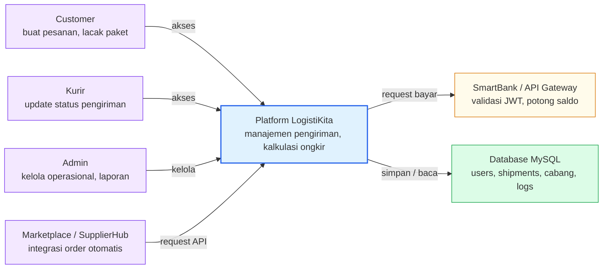
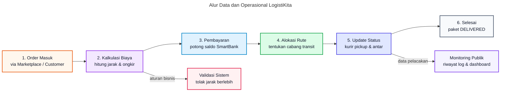
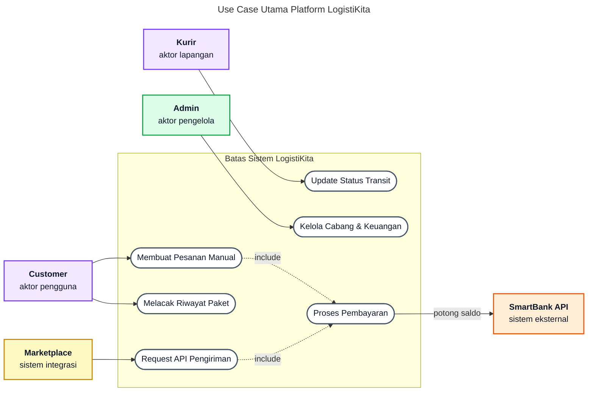

# SOFTWARE REQUIREMENTS SPECIFICATION
Platform LogistiKita

| Atribut | Nilai |
| --- | --- |
| Nama Dokumen | Software Requirements Specification (SRS) Platform LogistiKita |
| Versi | 1.0 - Professional Requirements Baseline |
| Tanggal | 24 Juni 2026 |
| Sistem | LogistiKita / Aplikasi Ekosistem Simulasi Ekonomi UMKM |
| Pemilik Produk | Lab Riset / Dosen Mata Kuliah RPL 2 |
| Target Pembaca | Product owner, developer, QA engineer, maintainer, dan administrator operasional |
| Status | Dokumen kerja untuk baseline requirement dan validasi implementasi |

**Basis Penyusunan**
SRS ini disusun dari dokumentasi (README.md, PRD-frontend.md, PRD-backend.md) aplikasi LogistiKita yang aktif: pola MVC/Microservices pada backend (Node.js/Express) dan frontend (Next.js/React); skema database MySQL; serta kontrak integrasi dengan SmartBank dan API Gateway. Struktur dokumen mengikuti pola SRS yang lazim digunakan tim engineering: tujuan, scope, konteks sistem, aktor, constraint, kebutuhan spesifik, interface, data, business rules, risiko, acceptance criteria, dan traceability.

---

## Daftar Isi

1. Pendahuluan dan Konteks Dokumen
2. Gambaran Produk dan Batas Sistem
3. Konteks Operasional dan Arsitektur
4. Domain Data dan Aturan Bisnis
5. Kebutuhan Fungsional
6. Kebutuhan Non-Fungsional
7. Antarmuka Eksternal
8. Workflow Operasional
9. Risiko, Kontrol, dan Acceptance Criteria
10. Matriks Ketertelusuran
Lampiran A. Glosarium
Lampiran B. Referensi Internal

---

## 1. Pendahuluan dan Konteks Dokumen

### 1.1 Tujuan Dokumen
Dokumen ini mendefinisikan kebutuhan perangkat lunak untuk LogistiKita sebagai komponen operasional dalam ekosistem simulasi ekonomi UMKM pada Tugas Besar Mata Kuliah RPL 2.

SRS ini berfungsi sebagai baseline bersama antara pemilik produk, pengembang, penguji, dan pengelola sistem. Dokumen tidak dimaksudkan sebagai uraian konseptual, melainkan sebagai spesifikasi yang menerjemahkan perilaku aplikasi ke dalam kebutuhan yang dapat dibangun, diuji, dan dipelihara. Setiap kebutuhan dirumuskan agar memiliki ruang lingkup yang jelas, dasar implementasi yang dapat ditelusuri, dan kriteria penerimaan yang dapat diverifikasi.

### 1.2 Ruang Lingkup Produk
LogistiKita adalah aplikasi manajemen pengiriman barang yang berfungsi sebagai *cost driver* dalam ekosistem ekonomi UMKM. Aplikasi ini menyediakan layanan pengiriman barang dengan tiga tipe layanan (Reguler, Nextday, Sameday), dilengkapi fitur tracking melalui sistem cabang transit. Sistem berjalan sebagai aplikasi Microservices dengan Frontend Next.js, Backend Node.js/Express, dan database MySQL.

Sistem LogistiKita bertanggung jawab pada siklus pengiriman: menerima request pengiriman, menghitung jarak dan ongkos kirim menggunakan formula Haversine, menentukan rute antar cabang, mengirimkan request pembayaran ke SmartBank, serta menyediakan pelacakan (tracking) dan dashboard untuk Kurir dan Admin.

### 1.3 Out of Scope
Dokumen ini tidak menspesifikasikan mekanisme pembayaran atau pengelolaan saldo secara langsung, karena fitur tersebut didelegasikan sepenuhnya ke aplikasi SmartBank. LogistiKita tidak menyimpan saldo dompet digital pengguna maupun penjual. 

| Area | Status Scope | Rasional |
| --- | --- | --- |
| Pembayaran Langsung / Dompet | Di luar scope | LogistiKita tidak memproses pembayaran secara langsung. Semua proses potong saldo dilakukan melalui SmartBank. |
| Katalog Produk | Di luar scope | LogistiKita murni sebagai penyedia layanan pengiriman. Katalog produk diurus oleh aplikasi Marketplace atau SupplierHub. |

---

## 2. Gambaran Produk dan Batas Sistem

### 2.1 Product Perspective
Aplikasi ini menempati posisi sebagai layanan logistik dalam ekosistem UMKM. Secara teknis, aplikasi LogistiKita dibagi menjadi frontend dan backend yang berdiri sendiri, dengan database MySQL khusus logistik. LogistiKita terintegrasi dengan API Gateway untuk validasi JWT dan meneruskan permintaan pembayaran ke SmartBank. Marketplace dan SupplierHub memanggil LogistiKita secara otomatis melalui API Gateway.

**Konteks Sistem LogistiKita**



*Gambar 1. Konteks sistem LogistiKita*

### 2.2 User Classes dan Karakteristik
Sistem melayani beberapa kelas pengguna dengan hak dan ekspektasi yang berbeda. 

| User Class | Tanggung Jawab | Ekspektasi Sistem | Kontrol Akses |
| --- | --- | --- | --- |
| Customer | Membuat pengiriman mandiri, melacak paket, melihat daftar pengiriman. | Form pemesanan mudah, kalkulasi ongkir akurat, status tracking real-time. | Session customer, tidak dapat mengakses dashboard admin/kurir. |
| Kurir | Melakukan pickup, transit cabang, dan antar ke penerima (delivery). | Dashboard untuk update status mudah (satu klik), daftar tugas yang jelas. | Session kurir melalui /dashboard/kurir. |
| Admin | Memantau seluruh sistem, mengelola user, cabang, pengiriman, dan melihat laporan keuangan. | UI operasional lengkap, ringkasan dan chart informatif. | Session admin melalui /admin. |
| Sistem Integrasi | Membuat request pengiriman secara otomatis dari aplikasi lain. | Kontrak JSON stabil, kalkulasi ongkir otomatis yang deterministik. | Menggunakan token autentikasi integrasi API Gateway. |

### 2.3 Operating Environment
| Komponen | Spesifikasi Saat Ini | Implikasi Requirement |
| --- | --- | --- |
| Runtime Frontend | Next.js dengan React | Server Side Rendering dan routing diatur melalui Next.js App Router. |
| Runtime Backend | Node.js dengan Express | Endpoint API harus tersedia dan dikelompokkan dengan rapi di route Express. |
| Database | MySQL | Skema data harus menjaga integritas tabel `users`, `shipments`, `branches`, dll. |
| Integrasi Eksternal | API Gateway & SmartBank | Pemanggilan eksternal harus ditangani dengan try/catch dan gracefully handling kegagalan. |

---

## 3. Konteks Operasional dan Arsitektur

### 3.1 Architectural Overview
Aplikasi menggunakan pola arsitektur Microservices. Frontend (Next.js) bertugas menampilkan antarmuka dan memanggil Backend API. Backend (Node.js/Express) menangani alur request seperti login, pengisian form pengiriman, update status oleh kurir, dan admin dashboard. Backend terhubung langsung dengan Database MySQL dan API Gateway untuk request pembayaran ke SmartBank.

### 3.2 Data Flow
Alur pengiriman dapat berasal dari dua sumber:
1. **Otomatis**: Marketplace / SupplierHub mengirimkan order. LogistiKita menerima data, menghitung ongkir, meminta SmartBank untuk memproses pembayaran, lalu menyimpan data dan rute cabang.
2. **Manual**: User/Customer membuat pesanan via form UI di LogistiKita. Sistem menghitung ongkir, memproses pembayaran via SmartBank, dan memulai rute pengiriman.

Dalam proses pengiriman, kurir akan memperbarui status (Pickup -> In Transit -> At Branch -> Out for Delivery -> Delivered).

**Alur Data Pengiriman LogistiKita**



*Gambar 2. Alur data dari pesanan masuk hingga paket diterima beserta pelacakan riwayat.*

**Penjelasan Tambahan:**
- **Order Masuk**: Tahap awal ketika data pesanan dikirim dari Marketplace melalui API atau dari *form* pelanggan.
- **Kalkulasi Biaya & Validasi**: Sistem menghitung ongkos kirim secara internal. Jika pesanan *Sameday* >50km atau *Nextday* >250km, alur akan dialihkan ke blok *Validasi Sistem* dan pesanan digagalkan.
- **Pembayaran**: LogistiKita terhubung dengan API SmartBank untuk mengamankan biaya logistik.
- **Alokasi Rute & Update Status**: Ketika pesanan dibayar, sistem membangun urutan cabang operasional. Kurir kemudian memperbarui status pengiriman dari awal hingga *Delivered*.
- **Monitoring Publik**: Setiap transisi status dikirim ke *tracking log*, yang bisa dimanfaatkan publik untuk melacak riwayat paket serta dipantau di *dashboard* admin.

---

## 4. Domain Data dan Aturan Bisnis

### 4.1 Core Domain Entities

| Entitas | Deskripsi | Field Penting | Catatan Ownership |
| --- | --- | --- | --- |
| users | Data pengguna internal dan pelanggan LogistiKita. | `id`, `name`, `email`, `password`, `role`, `branch_id` | Akun dikelola langsung oleh LogistiKita secara lokal. Akun kurir dibuat oleh admin, sedangkan kustomer dapat mendaftar mandiri. |
| shipments | Data utama pesanan dan paket pengiriman. | `shipment_id`, `order_id`, `tipe_pengiriman`, `jarak_km`, `ongkir`, `fee_layanan`, `status` | Dibuat saat pesanan masuk (Marketplace/Form). Kepemilikan mutlak pada LogistiKita sebagai *system of record* status paket. |
| branches | Referensi letak titik cabang transit logistik. | `id`, `name`, `city`, `lat`, `lng`, `route_order` | Dikelola secara eksklusif oleh fungsi *Admin* LogistiKita. |
| shipment_routes | Rute transit yang dibentuk untuk panduan perjalanan. | `shipment_id`, `branch_id`, `sequence`, `arrived_at`, `departed_at` | Dihasilkan oleh sistem setelah pembayaran lunas. Waktu *arrived/departed* diperbarui oleh interaksi sistem dan aksi *Kurir*. |
| tracking_logs | Catatan riwayat transisi status paket (timeline). | `shipment_id`, `status`, `keterangan`, `branch_id`, `created_at` | Ditulis secara *append-only* oleh *trigger* perubahan status. Bersifat *read-only* untuk dikonsumsi publik/kustomer. |
| transaction_logs | Histori komunikasi finansial dengan API eksternal. | `shipment_id`, `amount`, `transaction_id`, `status`, `error_code` | Disimpan oleh sistem setiap memanggil *API SmartBank*. Esensial untuk rekonsiliasi keuangan dan audit *fee* operasional. |

### 4.2 Business Rules

Aturan bisnis berikut adalah *constraint* operasional yang harus dipenuhi agar aplikasi tidak menyimpang dari batasan logika perhitungan biaya dan pembagian tanggung jawab finansial di ekosistem simulasi UMKM LogistiKita.

| ID | Aturan Bisnis | Dampak Implementasi |
| --- | --- | --- |
| BR-01 | Jarak dihitung menggunakan formula Haversine (garis lurus). | Kalkulasi ongkir otomatis di backend tanpa API pihak ketiga (misal Google Maps). |
| BR-02 | Sameday maksimal 50 km, Nextday maksimal 250 km. | Endpoint validasi jarak wajib menolak tipe pengiriman yang melampaui batas jarak. |
| BR-03 | Fee layanan LogistiKita adalah 5% dari total ongkos kirim. | Sistem backend secara eksplisit menghitung fee 5% dan memisahkannya dari ongkir utama dalam kalkulasi total tagihan. |
| BR-04 | Pembayaran dilakukan oleh SmartBank. | LogistiKita akan dianggap berstatus PENDING jika gagal bayar di SmartBank. |

---

## 5. Kebutuhan Fungsional

Kebutuhan fungsional ditulis dalam bentuk *shall statement* agar dapat menjadi dasar implementasi teknis dan pengujian terukur. Prioritas *Must* menunjukkan kemampuan fundamental untuk rilis operasional; *Should* berarti fitur krusial yang memperkuat kapabilitas; dan *Could* menunjukkan potensi peningkatan fitur berkelanjutan.

| ID | Area | Requirement | Priority | Acceptance Criteria |
| --- | --- | --- | --- | --- |
| FR-01 | Authentication | Sistem shall menyediakan login untuk Customer, Kurir, dan Admin. | Must | Pengguna valid dapat mengakses role masing-masing, sistem mengembalikan JWT Token. |
| FR-02 | Shipment Creation | Sistem shall memungkinkan Customer membuat pengiriman dari UI dengan input lokasi koordinat. | Must | Data pengiriman tersimpan, jarak dihitung, dan pembayaran otomatis dipicu. |
| FR-03 | API Shipment | Sistem shall menyediakan endpoint POST `/api/request_pengiriman` untuk sistem eksternal. | Must | LogistiKita dapat menerima order dari Marketplace dan merespons ongkir dan status. |
| FR-04 | Cost Calculation | Sistem shall menghitung jarak Haversine dan ongkir sesuai tarif tipe pengiriman + fee 5%. | Must | Ongkir yang dikembalikan konsisten dengan formula jarak. Terdapat penolakan jarak jauh untuk Sameday/Nextday. |
| FR-05 | Routing | Sistem shall membentuk rute cabang asal ke cabang tujuan berdasarkan `route_order` cabang. | Must | Cabang yang berada di antara asal dan tujuan tercatat di `shipment_routes`. |
| FR-06 | Courier Update | Sistem shall memungkinkan kurir mengupdate status menjadi PICKUP, AT_BRANCH, OUT_FOR_DELIVERY, DELIVERED. | Must | Kurir melihat tombol aksi di dashboard dan status paket termutakhirkan di `tracking_logs`. |
| FR-07 | Public Tracking | Sistem shall menyediakan pelacakan (tracking) publik melalui order ID tanpa login. | Must | Halaman /tracking menampilkan riwayat log yang sesuai order_id. |
| FR-08 | Admin Dashboard | Sistem shall menampilkan halaman admin dengan agregasi keuangan dan ringkasan pengiriman. | Must | Admin dapat memantau revenue 5% logistik dan status paket. |

---

## 6. Kebutuhan Non-Fungsional

Kebutuhan non-fungsional menyoroti kriteria kualitas (*quality attributes*) yang mutlak dipenuhi di luar fungsionalitas murni sistem. Penegakan poin ini sangat vital karena LogistiKita berhubungan langsung dengan transaksi saldo ke API eksternal dan wajib menopang pendataan *tracking* distribusi logistik berskala besar dengan integritas ketat.

| ID | Quality Attribute | Requirement | Verification |
| --- | --- | --- | --- |
| NFR-01 | Security | Sistem shall mengamankan endpoint non-publik dengan JWT validation. | Akses API dashboard kurir/admin tanpa JWT akan ditolak dengan status 401. |
| NFR-02 | Performance | Sistem shall merespons perhitungan ongkir dan routing dalam waktu < 500ms. | Test beban ringan pada endpoint biaya_pengiriman. |
| NFR-03 | Interoperability | Sistem shall mampu menerima JSON payload secara deterministik untuk integrasi API. | Konsumer aplikasi lain berhasil membaca format ongkir. |
| NFR-04 | Data Integrity | Sistem shall menerapkan transaction saat membuat pengiriman untuk mencegah inkonsistensi data. | Jika gagal hitung/simpan, tidak ada data shipment yang terpotong. |

---

## 7. Antarmuka Eksternal

### 7.1 User Interface Requirements
UI dikembangkan dengan Next.js dan Tailwind CSS, difokuskan pada pengoperasian antarmuka responsif untuk semua *role*. Halaman tidak hanya berfungsi sebagai *form*, melainkan sebagai *control surface* untuk integrasi internal dan interaksi pengguna.

| UI | Primary User | Requirement |
| --- | --- | --- |
| `/` | Publik | Landing page menjelaskan layanan LogistiKita dan widget pelacakan cepat. |
| `/login` | Publik | Menyediakan antarmuka masuk (*sign in*) untuk Kustomer, Kurir, maupun Admin. |
| `/register` | Publik | Memungkinkan pendaftaran akun baru secara mandiri bagi kustomer. |
| `/tracking` | Publik | Halaman untuk memasukkan ID Resi/Order dan menampilkan *timeline* histori pengiriman. |
| `/customer` | Customer | Halaman dasbor pelanggan yang memuat seluruh riwayat pesanan yang pernah mereka buat. |
| `/customer/buat` | Customer | Halaman *wizard* bagi pelanggan untuk input alamat, jarak interaktif, dan pesanan pengiriman manual. |
| `/kurir` | Kurir | Antarmuka dinamis (*dashboard* kurir) berisi daftar tugas rute (*pickup, transit, antar, delivered*) beserta kontrol aksi sekali klik. |
| `/admin` | Admin | *Dashboard* admin merangkum metrik pengiriman total, kurir aktif, dan indikator pendapatan 5% secara visual. |
| `/admin/*` | Admin | Halaman khusus operasi *backend* yang merangkap CRUD manajemen Cabang, Users, dan daftar komprehensif log Pengiriman. |

### 7.2 API Requirements

| Endpoint | Method | Consumer | Contract |
| --- | --- | --- | --- |
| `/api/auth/login` | POST | Frontend | Autentikasi lintas *role* dengan pengembalian *token JWT*. |
| `/api/request_pengiriman` | POST | Marketplace / Eksternal | Kontrak integrasi pembentukan pesanan logistik dari ekosistem otomatis di luar portal. |
| `/api/biaya_pengiriman` | POST | Publik / Frontend | *Endpoint open* penyedia parameter perhitungan jarak (*distance calculation*) dan estimasi ongkir interaktif. |
| `/api/tracking_status/:order_id` | GET | Publik / Frontend | Memberikan data histori paket secara lengkap (*read-only*) berdasarkan Resi/ID pesanan tanpa butuh *login*. |
| `/api/kurir/shipments/:id/status/*` | PUT | Kurir (UI) | Rangkaian mutasi state pada siklus pengiriman (seperti `/pickup` atau `/tiba-cabang`) yang diiringi pemutakhiran titik transit. |
| `/api/pembayaran_logistik` | POST | Internal Sistem | Sinkronisasi internal API guna menangkap persetujuan pemotongan saldo / tagihan finansial kepada *SmartBank Gateway*. |

### 7.3 Data Exchange Contract
Kontrak JSON pada `/api/request_pengiriman` harus diperlakukan sebagai basis *integration contract* yang ketat. Jika sistem eksternal (*Marketplace* atau *SupplierHub*) tidak mengirimkan parameter koordinat lintang dan bujur secara presisi, maka perhitungan jarak Haversine di aplikasi LogistiKita tidak akan berjalan. 

Contoh *payload* yang diwajibkan:
```json
{
  "order_id": "ORD-12345",
  "user_id": 99,
  "source_app": "marketplace",
  "tipe_pengiriman": "reguler",
  "alamat_asal": "Jl. Soekarno Hatta No 1, Bandung",
  "lat_asal": -6.9175,
  "lng_asal": 107.6191,
  "alamat_tujuan": "Jl. Sudirman No 2, Jakarta",
  "lat_tujuan": -6.2088,
  "lng_tujuan": 106.8456,
  "nilai_transaksi": 250000
}
```
Jika `tipe_pengiriman` diisi dengan `sameday` padahal selisih koordinat melebihi batas 50 kilometer, API akan menolak eksekusi dan mengembalikan JSON dengan Error Code 400.

---

## 8. Workflow Operasional

*Workflow* berikut menjabarkan serangkaian operasi sistem secara holistik pada kondisi skenario pemakaian *real-world*. Tiap-tiap *workflow* ini dapat ditarik sebagai garis besar pedoman *test case end-to-end* maupun *smoke testing* pasca-pengembangan (*deployment*).



*Gambar 3. Use case utama dan batas sistem.*

| Workflow | Trigger | Main Success Scenario | Failure/Control |
| --- | --- | --- | --- |
| Pengiriman Otomatis (Marketplace) | Notifikasi berhasil bayar *checkout*. | Marketplace mengirim POST order -> LogistiKita hitung ongkir -> API Payment ke SmartBank -> LogistiKita set PENDING/PICKUP. | SmartBank API menolak transaksi (saldo kurang), pesanan batal. |
| Pengiriman Manual | Customer melengkapi *form wizard*. | Kustomer melengkapi alamat -> Validasi jarak lolos -> Pembayaran berhasil di SmartBank -> Resi logistik terbit. | Jarak melebihi batas tipe layanan (*Sameday*), *checkout* digagalkan. |
| Update Status Pickup | Kurir menekan "Pickup". | Kurir mengambil barang, sistem memutakhirkan status menjadi IN_TRANSIT. | Paket tidak ditemukan atau sudah ditangani oleh kurir lain. |
| Transit Cabang | Kurir menekan "Tiba di Cabang". | Kurir mencapai target titik rute, paket ditandai *check-in* di *database* cabang. | - |
| Pengiriman Diterima | Kurir menekan "Delivered". | Paket tiba di pelanggan, status berubah DELIVERED, siklus *tracking* selesai. | - |
| Pemantauan Finansial | Admin membuka menu *dashboard*. | Sistem menyajikan agregat *fee* 5%, jumlah paket sukses, dan *chart* pendapatan secara *real-time*. | Jika database gagal diakses, indikator grafik menolak untuk dimuat (*error controlled*). |

---

## 9. Risiko, Kontrol, dan Acceptance Criteria

Menyadari posisi sistem LogistiKita yang bertindak selaku motor penarik ongkos operasional (*cost driver*) yang sensitif terhadap integrasi API Gateway, risiko mayoritasnya bukan hanya celah cacat visual (UI bug). Risiko tertingginya bertumpu pada manipulasi kalkulasi biaya, ketidakpastian respons penarikan saldo tagihan, hingga kerancuan status titik *tracking* akibat koneksi yang inkonsisten.

| Risk ID | Risiko | Kontrol Wajib | Acceptance Criteria |
| --- | --- | --- | --- |
| R-01 | Manipulasi jarak koordinat. | Jarak mutlak dihitung oleh backend menggunakan Haversine. | Mengubah field payload jarak manual via frontend diabaikan oleh backend. |
| R-02 | Pembayaran gagal (saldo kurang) dari SmartBank. | LogistiKita menunggu callback/response SmartBank sebelum confirm shipment. | Jika saldo kurang, LogistiKita melabeli FAILED dan tidak menjadwalkan pickup kurir. |
| R-03 | Paket dikirim tipe Nextday untuk jarak luar pulau. | Backend menolak jika jarak Nextday > 250km atau Sameday > 50km. | Mengembalikan JSON Error 400 'Jarak melebihi batas'. |

---

## 10. Matriks Ketertelusuran

*Traceability matrix* (matriks ketertelusuran) menautkan sasaran dan objektif strategis produk kepada ID *requirement* spesifik beserta cara konkrit pembuktiannya (verifikasi). Matriks ini berguna memandu *developer* serta jajaran *Quality Assurance (QA)* agar tetap pada rel fungsionalitas dan tidak merusak keutuhan sistem ketika mengubah kode.

| Objective | Requirement IDs | Evidence / Verification |
| --- | --- | --- |
| Menerima order otomatis dari platform belanja. | FR-03, FR-04, NFR-03 | Submit JSON /api/request_pengiriman; response ongkir konsisten. |
| Mengamankan biaya layanan operasional. | BR-03, FR-08 | Dashboard Admin menampilkan kalkulasi revenue 5% tepat. |
| Memberikan transparansi status ke end-user. | FR-06, FR-07 | Status tracking berubah sesuai penekanan tombol oleh akun Kurir di UI. |

---

## Lampiran A. Glosarium

| Istilah | Definisi Operasional |
| --- | --- |
| SmartBank | Aplikasi layanan keuangan sentral di ekosistem tempat pemotongan ongkir dieksekusi. |
| Haversine | Formula matematika untuk menghitung jarak lingkaran besar antara dua titik pada permukaan bumi dari koordinat bujur dan lintang mereka. |
| Route Order | Angka urutan (sequence) geografis dari barat ke timur yang menentukan hierarki transit cabang. |
| Cost Driver | Peran aplikasi LogistiKita yang berkontribusi pada pengeluaran finansial pengiriman dalam simulasi. |

## Lampiran B. Referensi Internal

| Artefak | Relevansi |
| --- | --- |
| README.md | Deskripsi umum aplikasi, fitur, struktur, aturan bisnis ongkir, dan flow. |
| PRD-frontend.md | Dokumen spesifikasi kebutuhan produk khusus antarmuka pengguna LogistiKita. |
| PRD-backend.md | Dokumen spesifikasi kebutuhan produk khusus sistem server dan API LogistiKita. |
